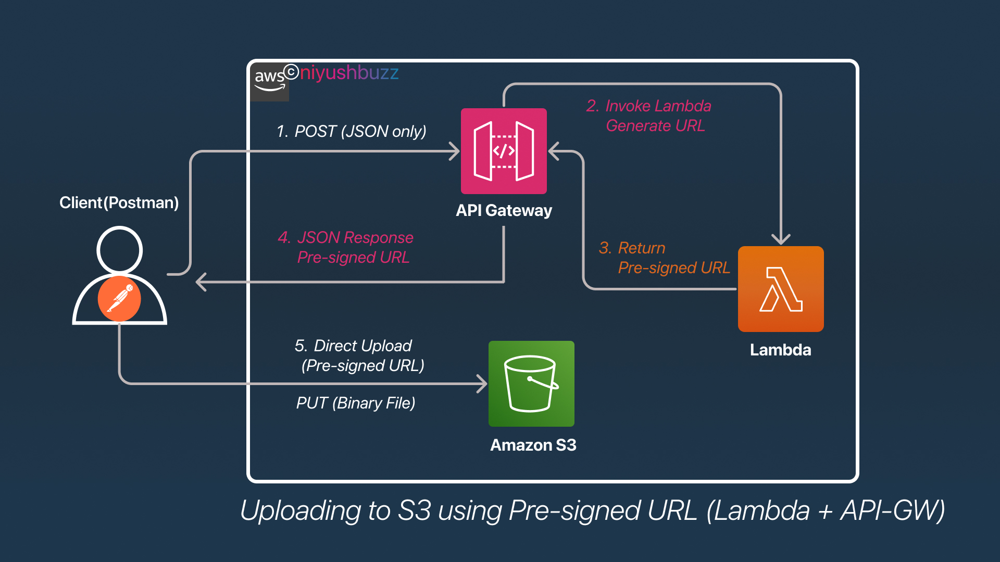

# Uploading Files to S3 using pre-signed URL 

---


[](https://nodejs.org/)

---

## Project Overview 

This project demonstrates the **most recommended and efficient approach** for uploading files to Amazon S3 using **Pre-signed URLs** with AWS Lambda and API Gateway.

###  Why Pre-signed URLs?

Traditional file upload methods through API Gateway have significant limitations:
- **10MB payload limit** on API Gateway
- **Base64 encoding overhead** increases file size by ~33%
- **Higher Lambda execution time** and costs
- **Memory constraints** when processing large files

This project solves these problems by using **Pre-signed URLs**, where files are uploaded **directly to S3**, bypassing API Gateway entirely for the actual file transfer.

---

| Step | Action | Endpoint | Method |
|------|--------|----------|--------|
| 1 | Request upload URL | API Gateway → Lambda | `POST` (JSON) |
| 2 | Receive pre-signed URL | Lambda → Client | JSON Response |
| 3 | Upload file directly | Client → S3 | `PUT` (Binary) |

---

### ✅ Benefits

| Benefit | Description |
|---------|-------------|
| **No file size limitations** | Bypasses API Gateway's 10MB limit |
| **Cost efficient** | Reduced Lambda execution time and memory usage |
| **No encoding overhead** | No Base64 encoding required |
| **Large file support** | Supports files up to 5GB (single PUT) or 5TB (multipart) |
| **Faster uploads** | Direct upload to S3, no middleman processing |
| **Secure** | Pre-signed URLs expire after configured time |
| **Scalable** | S3 handles unlimited concurrent uploads |

---

## Architecture 


---

## **Step 1: Create an S3 Bucket**

### **Via AWS Console:**
1. Go to **S3** in AWS Console
2. Click **Create bucket**
3. Enter a unique bucket name (e.g., `my-file-upload-bucket-12345`)
4. Select your preferred **AWS Region**
5. **Uncheck** "Block all public access" (we'll configure CORS)
6. Click **Create bucket**

### **Configure CORS for the Bucket:**
1. Go to your bucket → **Permissions** tab
2. Scroll to **Cross-origin resource sharing (CORS)**
3. Click **Edit** and add:

```json
[
    {
        "AllowedHeaders": ["*"],
        "AllowedMethods": ["GET", "PUT", "POST", "DELETE", "HEAD"],
        "AllowedOrigins": ["*"],
        "ExposeHeaders": ["ETag"],
        "MaxAgeSeconds": 3000
    }
]
```

> ⚠️ **Note:**  `"AllowedOrigins": ["*"]` with your specific domain(s).

---

## **Step 2: Create IAM Role for Lambda**

### **Via AWS Console:**
1. Go to **IAM** → **Roles** → **Create role**
2. Select **AWS Service** → **Lambda**
3. Click **Next**
4. Attach these policies:
   - `AWSLambdaBasicExecutionRole` (for CloudWatch logs)
5. Click **Next**, name it `lambda-s3-presigned-url-role`
6. Click **Create role**

### **Add Inline Policy for S3 Access:**
1. Go to the role you just created
2. Click **Add permissions** → **Create inline policy**
3. Select **JSON** tab and paste:

```json
{
    "Version": "2012-10-17",
    "Statement": [
        {
            "Effect": "Allow",
            "Action": [
                "s3:PutObject",
                "s3:GetObject"
            ],
            "Resource": "arn:aws:s3:::my-file-upload-bucket-12345/*"
        }
    ]
}
```

4. Click **Next**, name it `S3PresignedUrlPolicy`
5. Click **Create policy**

---

## **Step 3: Create the Lambda Function**

### **Via AWS Console:**
1. Go to **Lambda** → **Create function**
2. Select **Author from scratch**
3. Configure:
   - **Function name:** `generatePresignedUrl`
   - **Runtime:** `Node.js 20.x`
   - **Architecture:** `x86_64`
   - **Execution role:** Use existing role → `lambda-s3-presigned-url-role`
4. Click **Create function**

### **Lambda Code:**
use the Code from the file `preSignedURL.js` 
※Make sure to update the variable names 

```js 
const BUCKET_NAME = process.env.BUCKET_NAME || "YOUR_BUCKET_NAME";
```

### **Configure Environment Variables:**
1. In your Lambda function, go to **Configuration** → **Environment variables**
2. Click **Edit** → **Add environment variable**
3. Add:
   - **Key:** `BUCKET_NAME`
   - **Value:** `my-file-upload-bucket-12345` (your bucket name)
4. Click **Save**

---

## **Step 4: Create REST API Gateway**
### **4.1 Create the API**

1. Go to **API Gateway** → **Create API**
2. Select **REST API** (not private) → **Build**
3. Configure:
   - **Protocol:** REST
   - **Create new API:** New API
   - **API name:** `FileUploadAPI-REST`
   - **Endpoint Type:** Regional
4. Click **Create API**

---

### **4.2 Create Resource**

1. In the left panel, click on **Resources**
2. Click **Actions** → **Create Resource**
3. Configure:
   - **Resource Name:** `get-upload-url`
   - **Resource Path:** `get-upload-url`
   - ✅ **Enable API Gateway CORS** (Check this box!)
4. Click **Create Resource**

---

### **4.3 Create POST Method**

1. Select the `/get-upload-url` resource
2. Click **Actions** → **Create Method**
3. Select **POST** from dropdown → Click the checkmark ✓
4. Configure integration:
   - **Integration type:** Lambda Function
   - ✅ **Use Lambda Proxy integration** (Important!)
   - **Lambda Region:** Your region
   - **Lambda Function:** `generatePresignedUrl`
5. Click **Save**
6. Click **OK** when prompted about permissions

---

### **4.4 Create GET Method (Optional)**

Repeat the same steps for GET method if needed:

1. Select `/get-upload-url` resource
2. **Actions** → **Create Method** → **GET**
3. Same configuration as POST
4. Click **Save**

---

### **4.5 ⚠️ Configure CORS (Critical for REST API)**

This is the **main difference** from HTTP API. You must manually configure CORS:

1. Select the `/get-upload-url` resource
2. Click **Actions** → **Enable CORS**
3. Configure:
   - **Access-Control-Allow-Methods:** ✅ POST, ✅ GET, ✅ OPTIONS
   - **Access-Control-Allow-Headers:** `Content-Type,X-Amz-Date,Authorization,X-Api-Key,X-Amz-Security-Token`
   - **Access-Control-Allow-Origin:** `*` (or your specific domain)
4. Click **Enable CORS and replace existing CORS headers**
5. Click **Yes, replace existing values**

---

### **4.6 Deploy the API**

1. Click **Actions** → **Deploy API**
2. Configure:
   - **Deployment stage:** [New Stage]
   - **Stage name:** `prod`
   - **Stage description:** Production stage
3. Click **Deploy**

### **Note Your Invoke URL:**
After deployment, you'll see the **Invoke URL**:
```
https://abc123xyz.execute-api.us-east-1.amazonaws.com/prod
```

> ⚠️ **Important:** REST API URLs include the stage name (`/prod`), unlike HTTP API!

---
## **REST API - Additional Features You Can Use**

Since you're using REST API, you have access to these additional features:

### **1. API Keys & Usage Plans**

```
1. API Gateway → API Keys → Create API Key
2. Usage Plans → Create Usage Plan (set throttling/quota)
3. Associate API Key with Usage Plan
4. In your method, set "API Key Required: true"
```

### **2. Request Validation**

```
1. Go to Models → Create Model (JSON Schema)
2. In Method Request → Request Validator → Validate body
```

### **3. Caching**

```
1. Go to Stages → Your Stage → Settings
2. Enable API Cache
3. Set Cache capacity and TTL
```

### **4. WAF Integration**

```
1. Go to AWS WAF → Create Web ACL
2. Associate with your REST API stage
```
---

## **Key Differences Summary**

| Aspect | HTTP API | REST API |
|--------|----------|----------|
| **CORS Setup** | Automatic | Manual (Enable CORS action) |
| **URL Format** | `https://api-id.execute-api.region.amazonaws.com/` | `https://api-id.execute-api.region.amazonaws.com/prod/` |
| **Lambda Proxy** | Default | Must check "Use Lambda Proxy integration" |
| **Method Creation** | Route-based | Resource + Method based |
| **OPTIONS Method** | Auto-created | Created by "Enable CORS" action |

---

## **Step 5: Client-Side Implementation**

##### **Optional If you prefer Testing it via front-end:**

use the  `index.html` file: or `React_Version.js` 
> Make sure to update the `API_ENDPOINT` to actual Invoke URL.

---

## **Step 6: Testing With Postman**

### Step 6.1: Get Pre-signed URL (JSON request, NO file)
- Click New → HTTP Request
- Configure:
- Method: `POST`
- URL: `https://your-api-id.execute-api.us-east-1.amazonaws.com/prod/get-upload-url`


```json
// Headers:
  Content-Type: application/json

// Body (raw JSON):
{
    "fileName": "myfile.pdf",
    "contentType": "application/pdf"
}
```

- Click on Send.

Response:

```json
{
    "uploadUrl": "https://your-bucket.s3.amazonaws.com/uploads/...",
    "fileKey": "uploads/123456-abc-myfile.pdf",
    "expiresIn": 300
}
```
---

### Step 6.2: Upload File to S3 (Using the pre-signed URL)
- Click New → HTTP Request
- Configure:
- Method: `PUT`
- URL : `https://your-bucket.s3.amazonaws.com/uploads/...  (the uploadUrl from Step 7.1)`

**Headers Tab**:
| Key | 	Value| 
| ---| ---| 
| Content-Type	| application/pdf| 

**Body Tab:**
- Select binary
- Click Select File
- Choose your PDF file
- Click `Send`

**Response:**
```
Status : 200 OK Time : 〇〇ms Size : XXX B
Body: (empty)
```
---

## **Step 7: Confirm the Upload of the file in S3 Bucket**

> Head  over to S3 and confirm that the file has been uploaded successfully.

---

## **Troubleshooting REST API Specific Issues**

### **1. CORS Errors**

 **`Access to fetch has been blocked by CORS policy`**

```
1. Go to API Gateway → Your API → Resources
2. Select your resource (/get-upload-url)
3. Actions → Enable CORS
4. Make sure all methods are checked
5. Click "Enable CORS and replace existing CORS headers"
6. ⚠️ REDEPLOY your API (Actions → Deploy API)
```

### **2. Missing OPTIONS Method**

`The "Enable CORS" action should create an OPTIONS method automatically. If not:`

1. Select resource → **Actions** → **Create Method** → **OPTIONS**
2. Integration type: **Mock**
3. Click **Save**
4. Go to **Method Response** → Add `200` response
5. Go to **Integration Response** → Add header mappings:
   ```
   Access-Control-Allow-Headers: 'Content-Type,X-Amz-Date,Authorization,X-Api-Key'
   Access-Control-Allow-Methods: 'GET,POST,OPTIONS'
   Access-Control-Allow-Origin: '*'
   ```

### **3. 403 Forbidden / Missing Authentication Token**

**API returns 403 error**

- Make sure you're using the correct URL with stage name: `/prod/get-upload-url`
- Redeploy the API after making changes

### **4. Changes Not Reflecting**

**API changes don't work**

```
⚠️ You MUST redeploy REST API after every change!
Actions → Deploy API → Select stage → Deploy
```

---

## Step 8 : Delete Resources at the end.

To avoid unnecessary charges $ make sure to delete resources at the end.

- ☑ Delete S3 Bucket
- ☑ Delete Lambda Function
- ☑ Delete the API Gateway
- ☑ Delete the IAM role (optional)
- ☑ Delete Cloudwatch logs 

---

## 🤝 Contributing
Contributions are welcome! Please feel free to submit a Pull Request.

---

## 📄 License
This project is licensed under the MIT License - see the LICENSE file for details.

---

## 👤 Author
Created by Niyush Bjr
<br>
[☕ Buy Me a Coffee](http://buymeacoffee.com/niyushbjr1L)

---

⭐ If you found this project helpful, please consider giving it a star!