# Lab 1: API Gateway REST API with Cognito User Pool Authorizer

---

## **Architecture Diagram:**

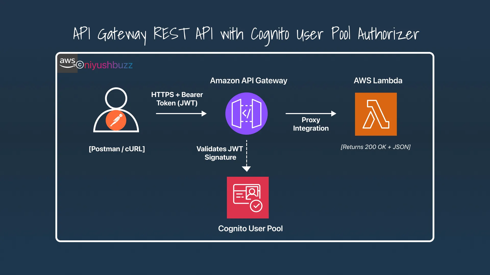

---

### **Step 1: Create the Cognito User Pool**

1. Log into the AWS Console and navigate to **Cognito**.
2. Click **Create user pool**.
3. **Step 1: Configure sign-in experience**:
    - Under *Cognito user pool sign-in options*, select **Email** (Check the box).
    - Click **Next**.
4. **Step 2: Configure security requirements**:
    - *Multi-factor authentication*: Select **No MFA** (Keep costs/complexity low for Lab 1).
    - *User account recovery*: Select **Self-service** (Email only).
    - Click **Next**.
5. **Step 3: Configure sign-up experience**:
    - Leave defaults (Enable self-registration).
    - Click **Next**.
6. **Step 4: Configure message delivery**:
    - Select **Send email with Cognito**.
    - Click **Next**.
7. **Step 5: Integrate your app**:
    - *User pool name*: `api-security-lab-pool`
    - *Initial app client*:
        - *App type*: Select **Public client** (For SPAs/Mobile).
        - *Client name*: `lab-web-client`
        - *Client secret*: **Don't generate a client secret** (Public clients cannot hide secrets).
        - *Allowed callback URLs*: `http://localhost` (Placeholder for now).
        - *Allowed sign-out URLs*: `http://localhost`
        - *OAuth 2.0 grant types*: Check **Authorization code grant** and **Implicit grant**.
    - Click **Next**.
8. **Step 6: Review and create**:
    - Review settings and click **Create user pool**.
    - 📝 **Note the User Pool ID** (e.g., `ap-northeast-1_xxxxxxxx`) and save it.

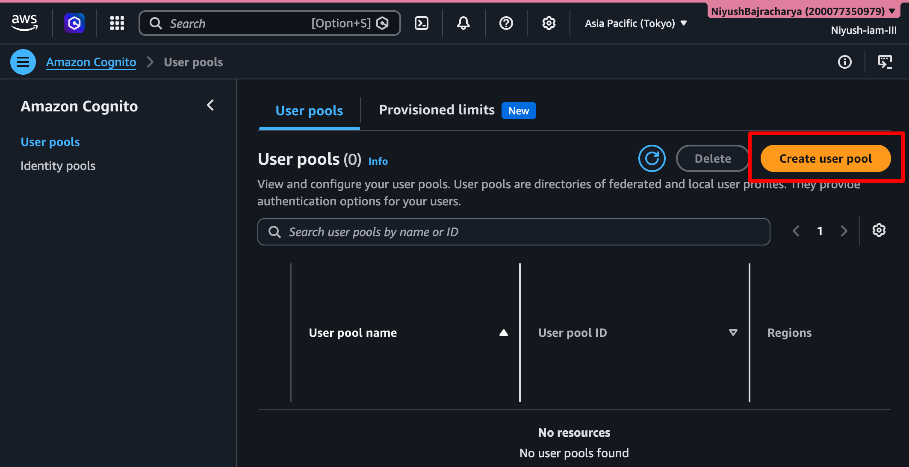

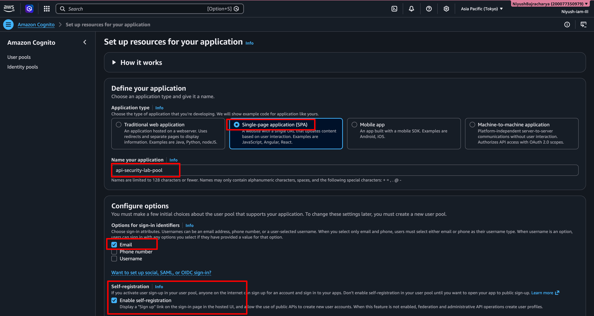

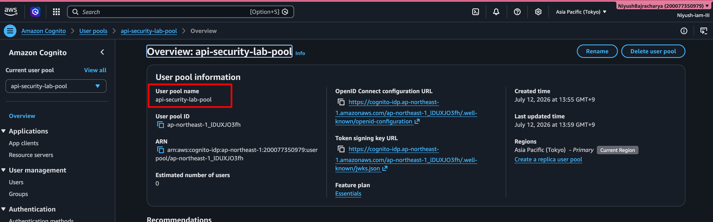

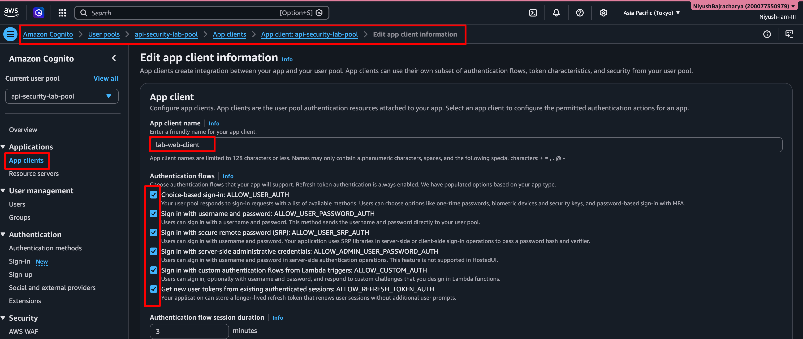

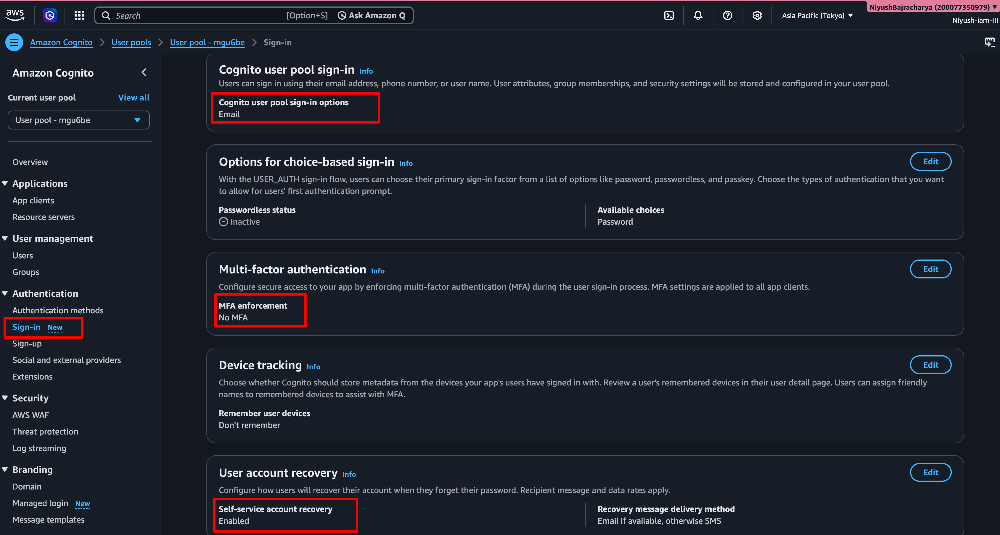

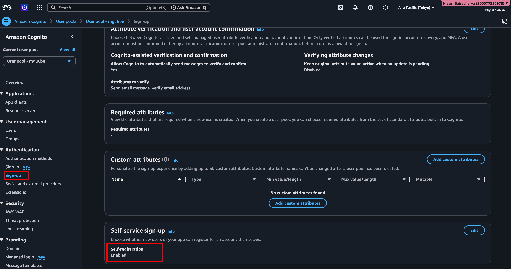

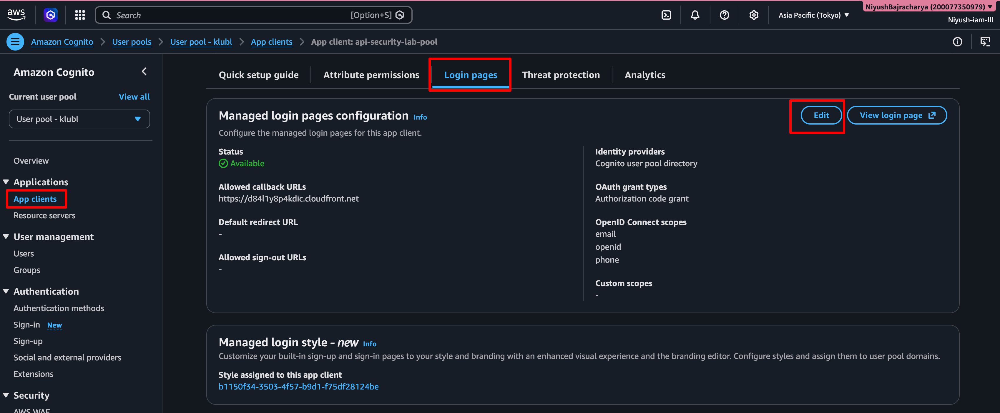

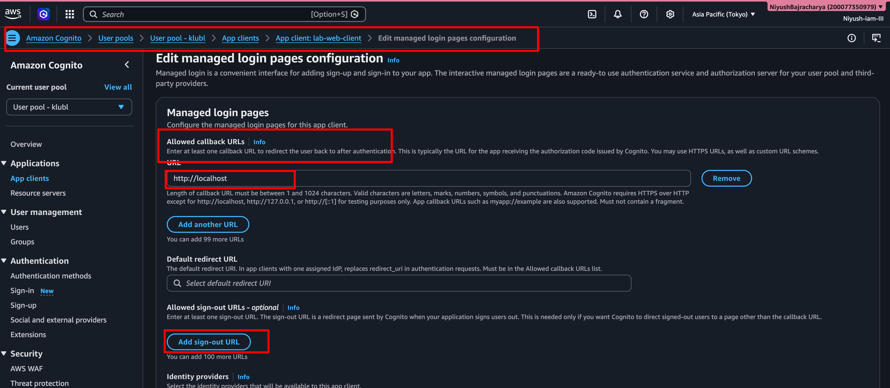

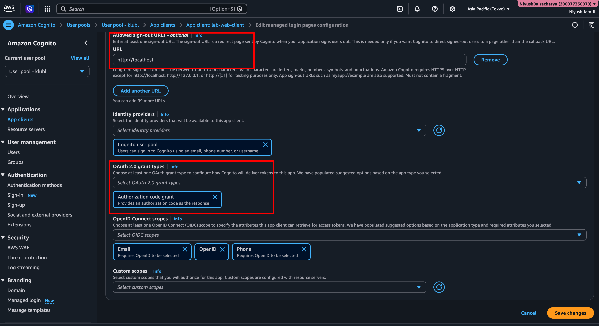

---

### Step 2 : Create the Lambda Function

1. Navigate to **Lambda** ➔ **Functions** ➔ **Create function**.
2. Select **Author from scratch**.
    - *Function name*: `cognito-backend-mock`
    - *Runtime*: **Python 3.12**
    - *Architecture*: **x86_64**
3. Click **Create function**.
    - Sample python code use the code [lambda_handler.py](lambda_hander.py)

4.  Click **Deploy** (or `Ctrl+S` / `Cmd+S`).


---

### **Step 3: Create the API Gateway REST API**

1. Navigate to **API Gateway** ➔ **Create API**.
2. Under *REST API*, click **Build**. (Do *not* choose REST API Private).
3. *Choose Protocol*: **REST**.
4. *Create new API*: **New API**.
    - *API name*: `CognitoSecureAPI`
    - *Endpoint Type*: **Regional** (Cheaper and sufficient for this lab).
5. Click **Create API**.

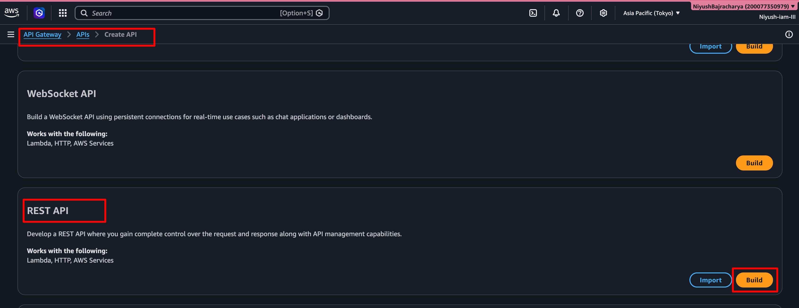

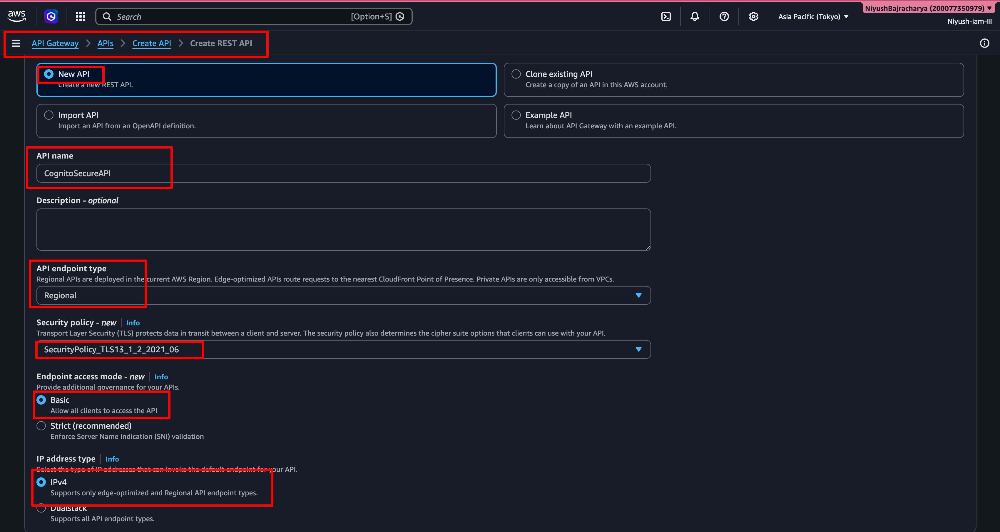

---

### **Step 4: Create the Cognito Authorizer in API Gateway**

1. In the left pane of your API, click **Authorizers** ➔ **Create New Authorizer**.
2. *Name*: `CognitoAuth`
3. *Type*: Select **Cognito**.
4. *Cognito User Pool*: Start typing and select `api-security-lab-pool`.
5. *Token Source*: Type `Authorization` (This is the HTTP header API GW will inspect).
6. Click **Create**.

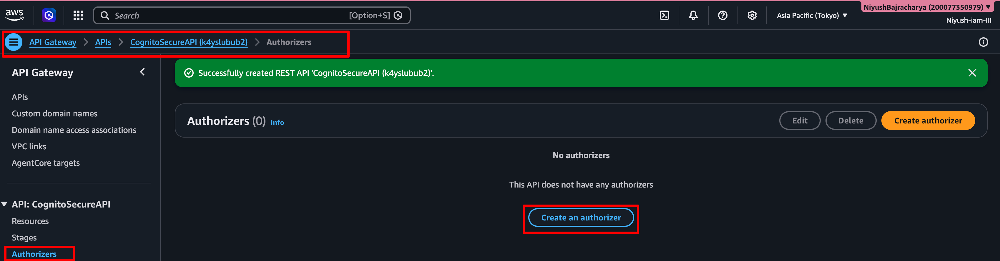

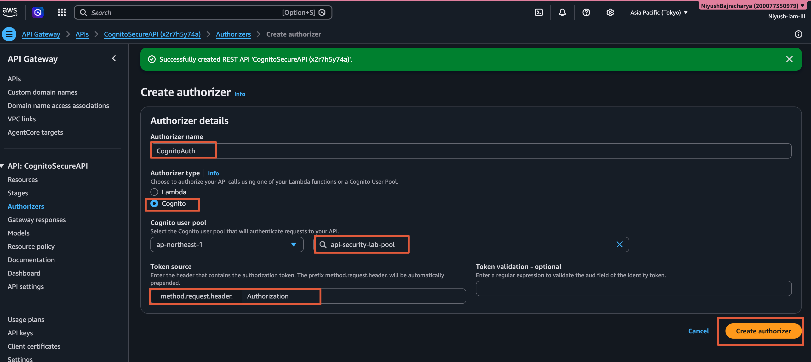

---

### Step 5 : **Create Resources and Methods**

1. Click **Resources** in the left pane.
2. Click **Actions** ➔ **Create Resource**.
    - *Resource Name*: `data`
    - *Resource Path*: `data`
    - Click **Create Resource**.
3. Select the `/data` resource. Click **Actions** ➔ **Create Method**.
    - Select **GET** from the dropdown and click the checkmark.
4. Configure the GET method:
    - *Integration type*: **Lambda Function**
    - *Use Lambda Proxy integration*: **Checked** (Crucial for passing the event context to Python).
    - *Lambda Function*: `cognito-backend-mock`
    - Click **Save** ➔ **OK** (Add Permission to Lambda).
5. **Attach the Authorizer**:
    - With the GET method selected, click the **Method Request** box.
    - *Settings* ➔ *Authorization*: Click the pencil icon, select `CognitoAuth`, and click the checkmark.
    - *Settings* ➔ *API Key Required*: `false`.
    - Click the back arrow to return to the method execution screen.

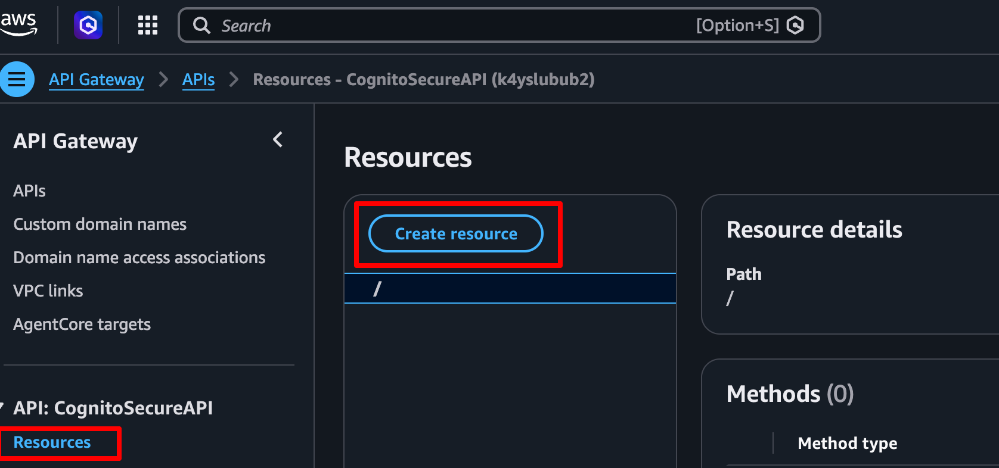

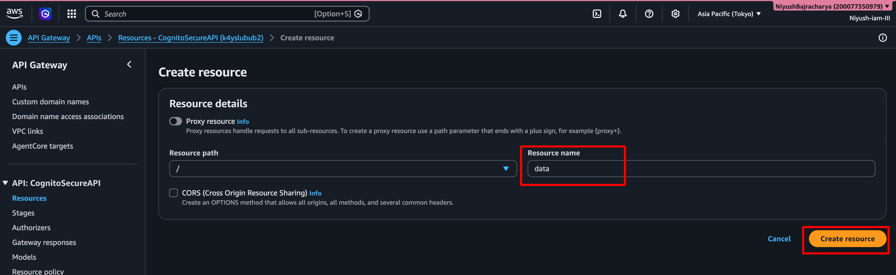

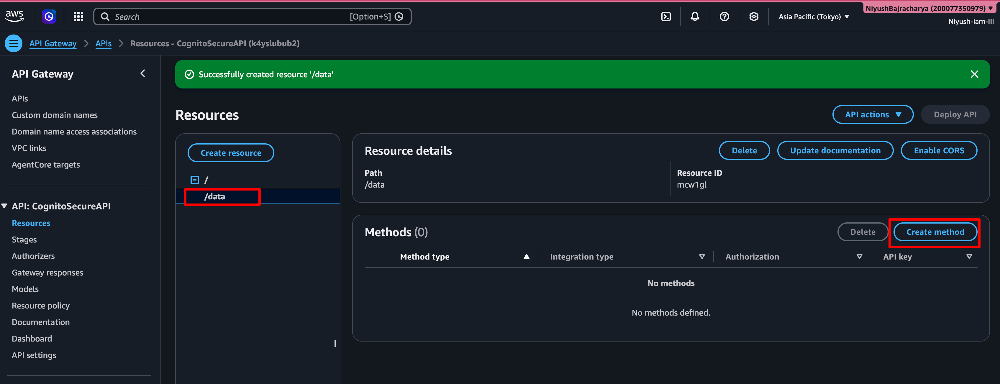

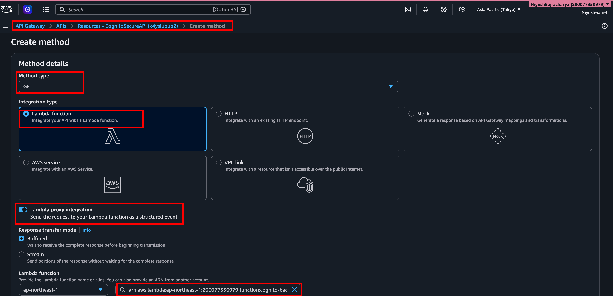

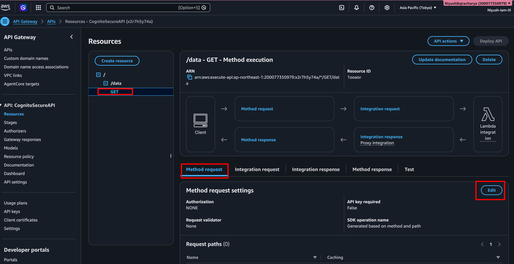

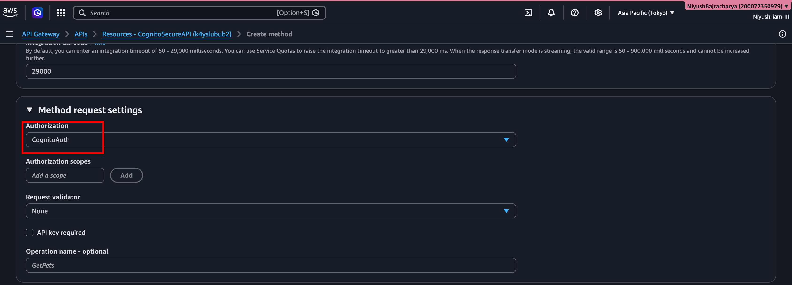

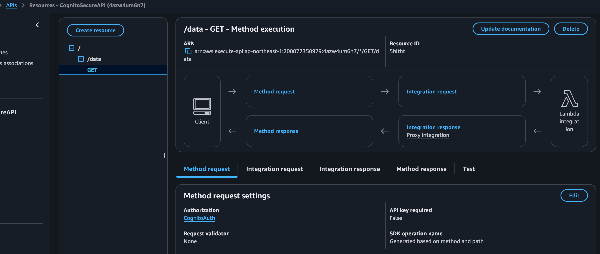

---

### **Step 6: Deploy the API**

1. lick **Actions** ➔ **Deploy API**.
2. *Deployment stage*: **[New Stage]**
    - *Stage name*: `dev`
3. Click **Deploy**.
4. 📝 **Copy the Invoke URL** (e.g., `https://abc123.execute-api.ap-northeast-1.amazonaws.com/dev`).

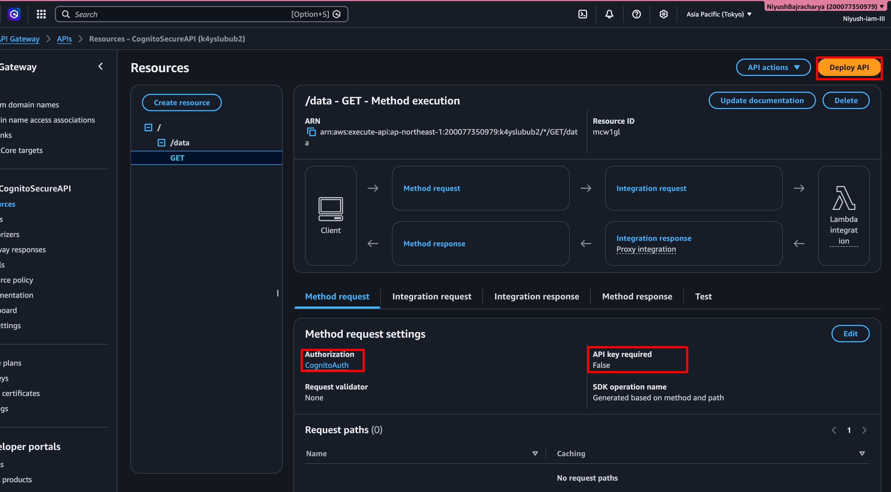

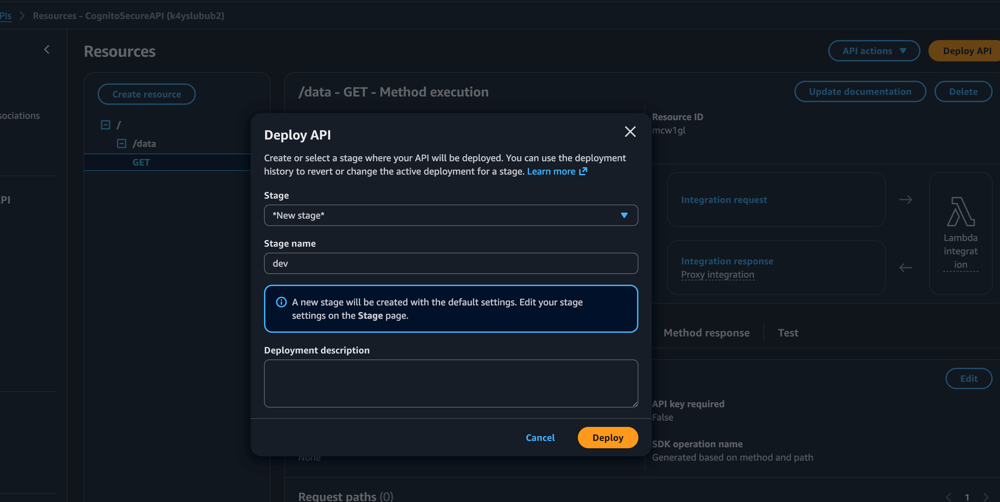

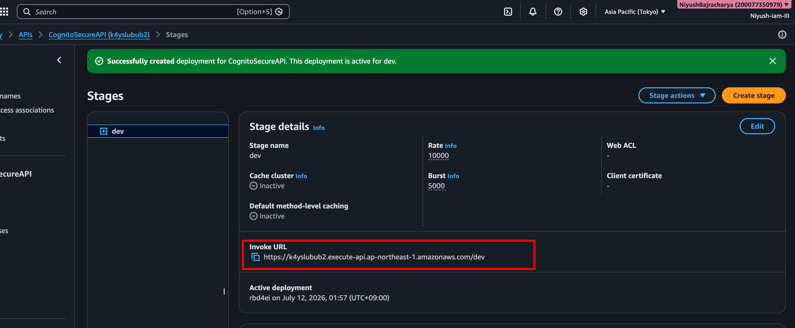

---

### **Step 7: Create a Test User and Fetch a Token**

*o test this, we need a valid JWT token. We will use the AWS CLI to create a user and authenticate them.*

1. Open your macOS **Terminal**.
2. Ensure AWS CLI is configured (`aws configure`) with an IAM user that has Cognito permissions.
3. Create a user (replace `YOUR_POOL_ID`):
- Sample code
    
    ```python
    aws cognito-idp admin-create-user \
        --user-pool-id YOUR_POOL_ID \
        --username youremail@address.com \
        --user-attributes Name=email,Value=youremail@address.com Name=email_verified,Value=true \
        --message-action SUPPRESS \
        --region ap-northeast-1
    ```
    
4.  Set a permanent password:
- sample bash code
    
    ```bash
    aws cognito-idp admin-set-user-password \
        --user-pool-id YOUR_POOL_ID \
        --username youremail@address.com \
        --password "Feveryoung1#" \
        --permanent \
        --region ap-northeast-1
    ```
    
5. **Find your App Client ID**: Go to Cognito Console ➔ `api-security-lab-pool` ➔ **App integration** tab ➔ `lab-web-client` ➔ Copy the **Client ID**.
6. Authenticate and get the `IdToken` (replace `YOUR_CLIENT_ID`):
- sample code
    
    ```bash
    aws congito-idp admin-initaite-auth \
        --user-pool-id YOUR_POOL_ID \
        --client-id YOUR-CLIENT-ID \
        --auth-flow ADMIN_USER_PASSWORD_AUTH \
        --auth-parameters USERNAME=yourusername@domain.com, PASSWORD="createdpasswprd" \
        --region ap-northeast-1
    ```
    
7. **Copy the long string inside `"IdToken"`** from the JSON output.

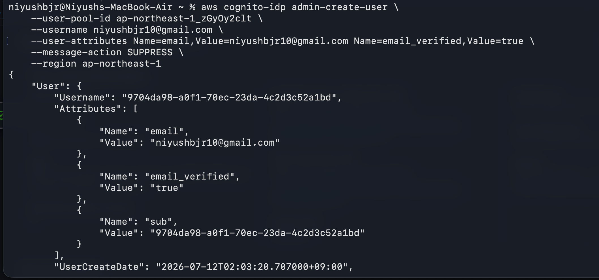

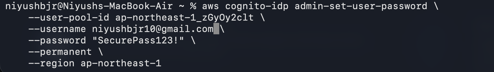

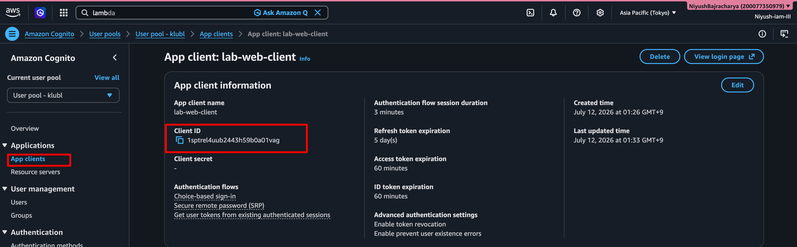

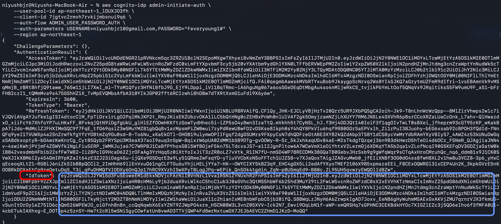

---

### **Step 8: Verification**

1. Open **Postman** (or use `curl` in Terminal).

```bash
curl -X GET "https://YOUR_INVOKE_URL-api.REGION.amazonaws.com/dev/data" \
     -H "Authorization: Bearer <YOUR_ID_TOKEN>"
```

1. Set method to **GET**.
2. URL: `https://YOUR_INVOKE_URL/dev/data`
3. Go to the **Headers** tab
4. Add Key: `Authorization`, Value: `[Bearer PASTE_YOUR_ID_TOKEN_HERE]`.
5. Click **Send**.
6. ✅ **Expected Output:** `200 OK` with body: `{"message": "Access Granted!", "authenticated_user": "testuser@example.com"...}`
7. ❌ **Negative Test:** Remove the Header and Send again. You should receive `{"message":"Unauthorized"}` with HTTP `401`.

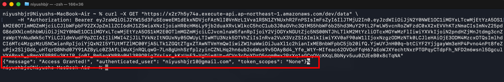