# Lab 2: Cognito App Client Configuration & OAuth2 Hosted UI

---

>### What this Project Aims
>   How to leverage Cognito's Managed Login (Hosted UI) to implement standard OAuth2 flows, configure custom scopes, and securely federate identity without building custom login screens.

---

### **Architecture Diagram:**

```markdown
[Web Browser]
      | (1. User clicks 'Login')
      v
[Web App] ──(Redirect)──> [Cognito Hosted UI / Managed Login]
      |                           |
      |                           | (2. User enters creds)
      |                           v
      |                   [Cognito User Pool]
      |                           |
      | (3. Returns Auth Code)    |
      v                           |
[Web App] ──(Exchange Code for Tokens)──> [Cognito OAuth2 Endpoint]
```

---

## **Step 1: Configure the Custom Domain (Cognito Provided)**

> *Note: Creating an ACM certificate and Route53 record for a custom domain takes hours to propagate and costs money/time. For this lab, we will use the Cognito-provided domain.*

1. Navigate to **Cognito** ➔ `api-security-lab-pool`.
2. Scroll down to **Domain**.
3. Under *Cognito domain*, click **Actions** ➔ **Create Cognito domain**.
4. Enter a globally unique prefix (e.g., `apisec-lab-yourname-123`).
5. Click **Save changes**.
6. 📝 **Note the Domain URL**: `https://apisec-lab-yourname-123.auth.ap-northeast-1.amazoncognito.com`

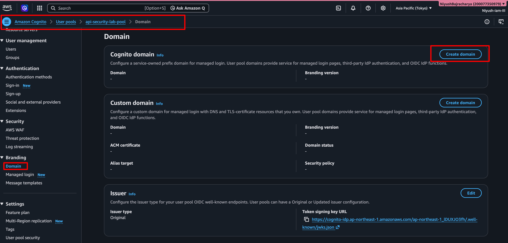


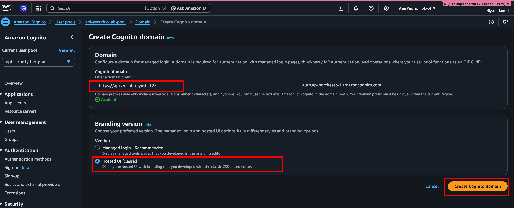

---


### **Step 2: Configure Hosted UI (Managed Login)**


1. Still in **App integration**, scroll to **App clients and analytics**.
2. Click on your app client: `lab-web-client`.
3. Scroll to **Hosted UI**. Click **Edit**.
4. **Client secret**: (Leave as none).
5. **Allowed callback URLs**: Add `http://localhost:3000/callback` (or any local testing URL).
6. **Allowed sign-out URLs**: Add `http://localhost:3000`.
7. **OAuth 2.0 grant types**: Ensure **Authorization code grant** is checked.
8. **OpenID Connect scopes**: Check `openid`, `email`, `profile`.
9. Click **Save changes**.


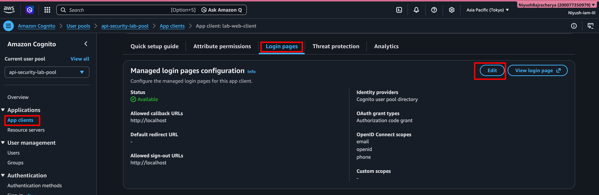

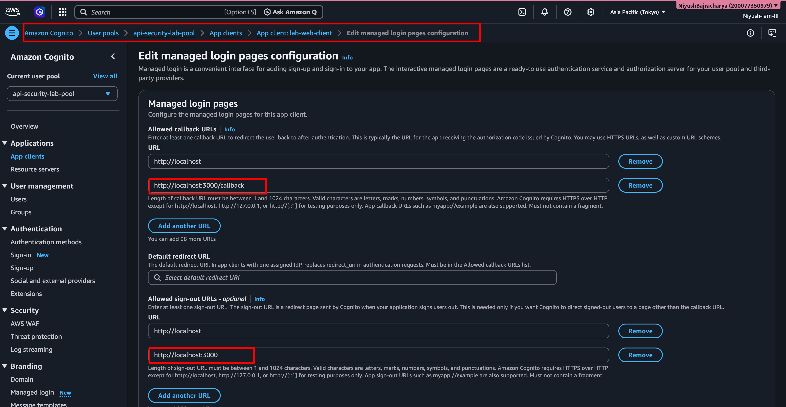

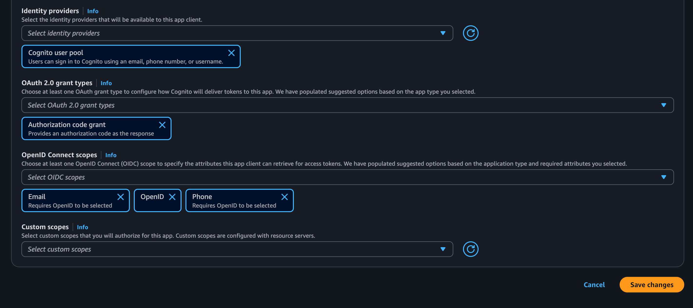


---


## **Step 3: Define Resource Servers and Custom Scopes**

> *Scopes allow you to limit what an access token can do. E.g., `read:items` vs `write:items`.*


1. In the left pane of the User Pool, click **Resource servers** (Under Integration).
2. Click **Create resource server**.
    - *Resource server name*: `FitnessAPI`
    - *Resource server identifier*: `https://fitness.api` (Must be a URI format).
3. Click **Add scopes**.
    - *Scope name*: `read.workouts`
    - *Description*: `Read workout history`
    - Click **Add scopes** again.
    - *Scope name*: `write.workouts`
    - *Description*: `Log new workouts`
4. Click **Create resource server**.
5. **Authorize the Scopes for the App Client:**
    - Go back to **App integration** ➔ `lab-web-client` ➔ **Hosted UI** ➔ **Edit**.
    - Under *Custom scopes*, expand `FitnessAPI` and check `read.workouts` and `write.workouts`.
    - Click **Save changes**.


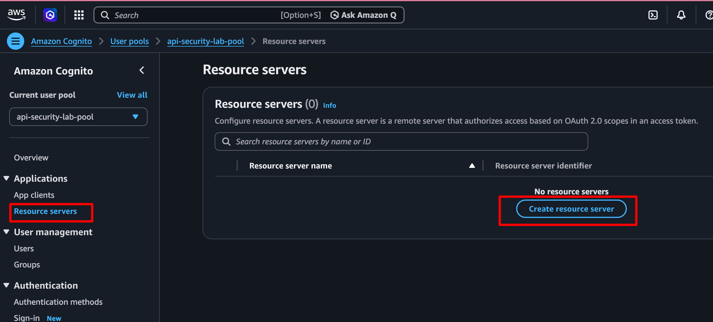

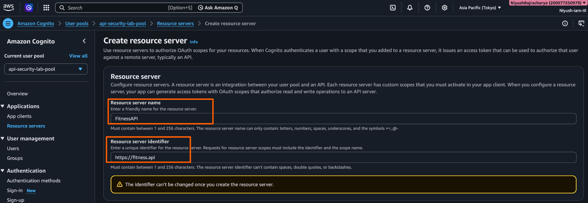

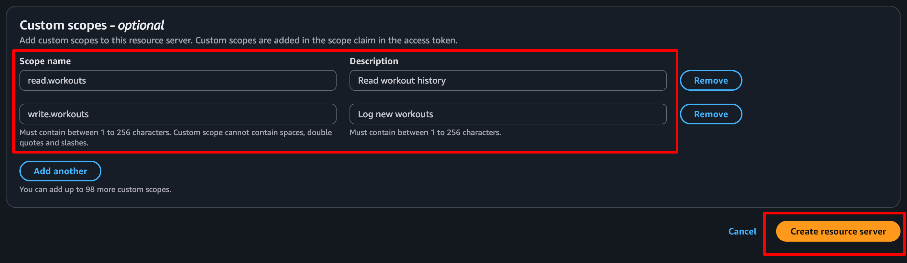


---


## **Step 4: Test the Authorization Code Grant Flow**


1. Open your text editor and construct the following URL (Replace placeholders):

```markdown
https://YOUR_COGNITO_DOMAIN/login?
response_type=code&
client_id=YOUR_CLIENT_ID&
redirect_uri=http://localhost:3000/callback&
scope=openid+email+profile+https://fitness.api/read.workouts
```

*(Ensure there are no spaces, use `+` or `%20` for spaces if needed).*

1. Copy and paste this URL into your **Web Browser**.
2. ✅ **Expected Result:** You are redirected to the AWS Managed Login page (Cognito Hosted UI).
3. Sign in with `testuser@example.com` and `SecurePass123!`.
4. After successful login, the browser will attempt to redirect to `http://localhost:3000/callback`.
5. Since you don't have a local server running on port 3000, the browser will show a "Connection Refused" or "Site can't be reached" error. **This is expected!**
6. 📝 **Look at the URL bar.** It will look like this:
`http://localhost:3000/callback?code=abc123xyz-4567-890...`
7. Copy the `code` parameter value. This is your **Authorization Code**.


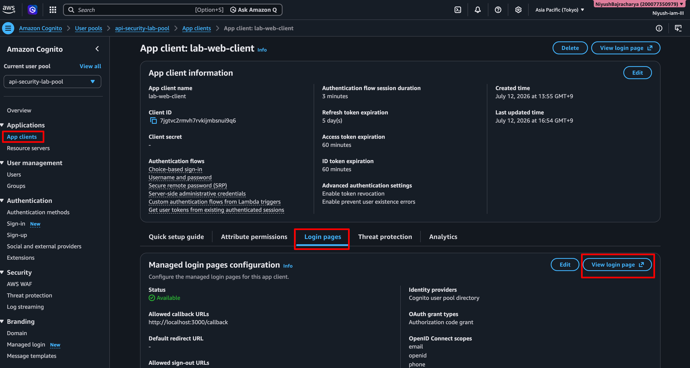


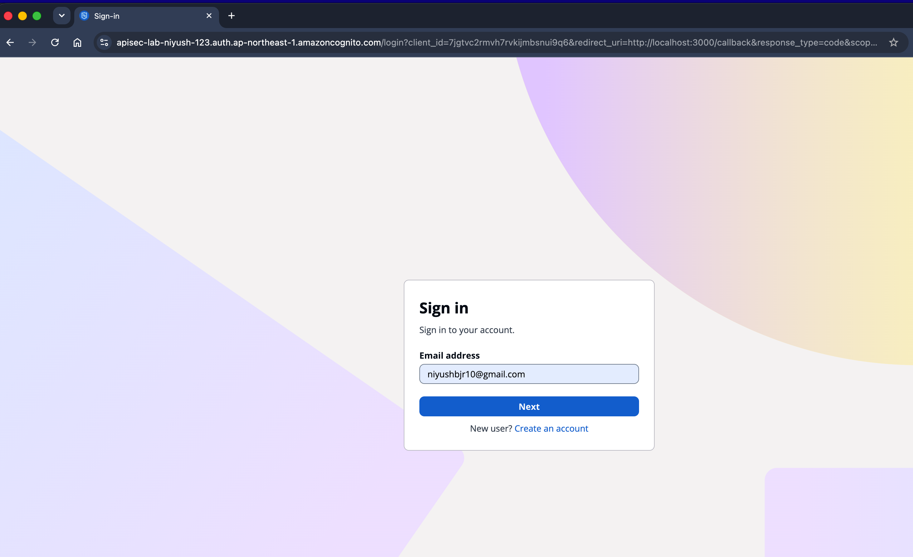

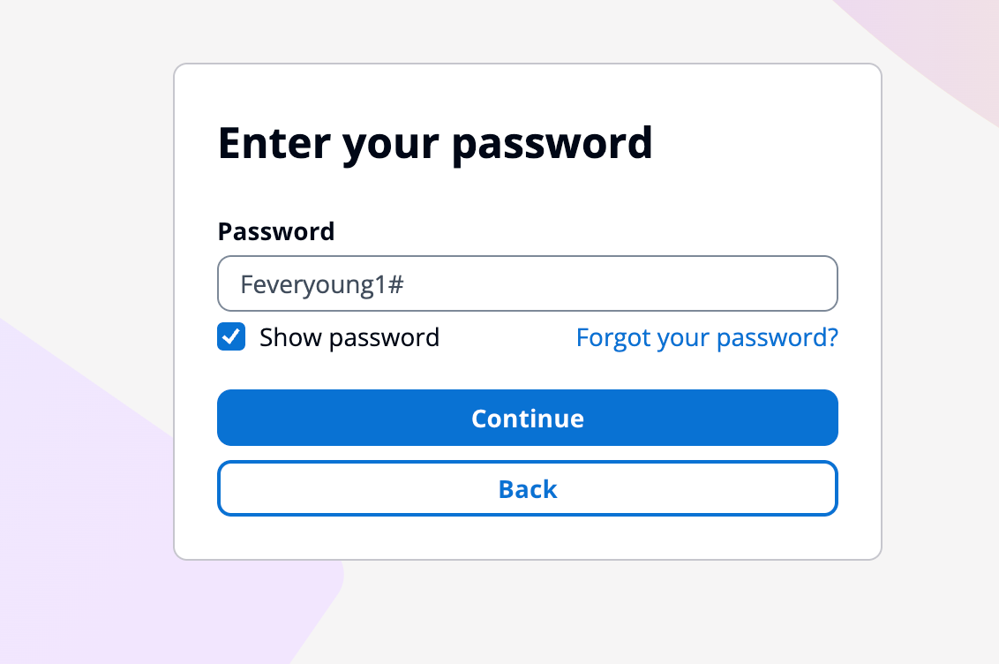

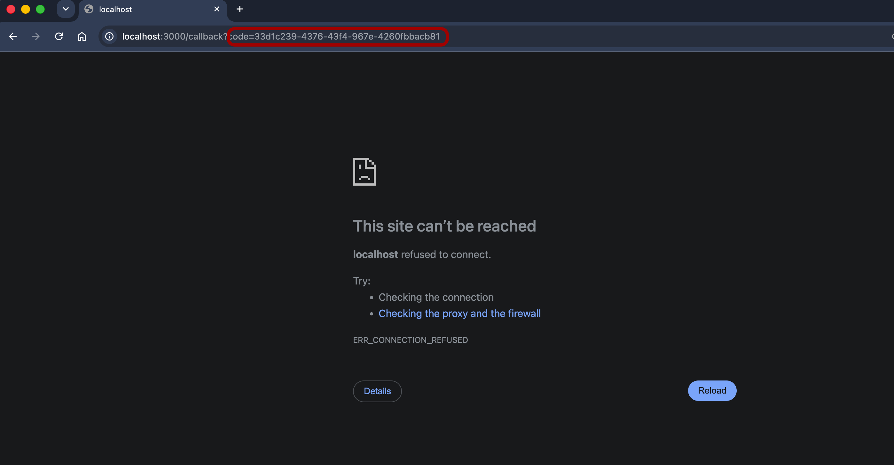
---

#### **Lab 2 Summary**

| Component | Configuration Choice | Why it Matters |
| --- | --- | --- |
| **Authorization Code Grant** | Selected over Implicit | Implicit flow exposes tokens in the URL fragment. Auth Code flow exchanges the code for tokens via a secure backend channel (PKCE is recommended for SPAs). |
| **Custom Scopes** | `https://fitness.api/read.workouts` | Allows API Gateway to validate not just *who* the user is, but *what specific action* the token is authorized to perform. |
| **Hosted UI** | Managed by AWS | Eliminates the need to write secure login forms, handle CSRF, or manage password reset UI flows. |


---

#### **🎯 Key Concepts Checklist (SAA-C03)**
- **OAuth2 Grant Types:** Know when to use Auth Code (Web Servers/SPAs with PKCE) vs Client Credentials (M2M backend services). 🎯
- **Custom Scopes:** API Gateway Cognito Authorizers can enforce scope validation natively using the `Authorization Scopes` setting in the Method Request.
- **Hosted UI Customization:** You can customize the CSS of the Hosted UI, but it requires hosting the CSS file on an S3 bucket with public read access or CloudFront.

---

#### **📝 Practice Exam Questions**

**Q3:** A Solutions Architect is designing a Single Page Application (SPA) using React. The SPA needs to authenticate users via Amazon Cognito and then call an API Gateway REST API. Which OAuth 2.0 grant type and security mechanism should be used?
A) Implicit Grant with the token stored in localStorage.
B) Authorization Code Grant with PKCE (Proof Key for Code Exchange).
C) Client Credentials Grant with a hardcoded client secret in the React code.
D) Resource Owner Password Credentials (ROPC) grant.

*Correct Answer: B. Explanation: SPAs cannot securely store client secrets. The Authorization Code Grant with PKCE is the industry standard and most secure method for public clients like SPAs and mobile apps.*

---

**Q4:** An application uses Cognito User Pools to generate JWTs. The backend API Gateway needs to ensure that the user has the specific permission `finance:read` before allowing access to the `/reports` endpoint. How can this be achieved with the LEAST operational overhead?
A) Write a Lambda Authorizer to decode the JWT and check the custom claims.
B) Use Cognito Identity Pools to map the user to an IAM role with `finance:read` policy.
C) Define a Custom Scope in a Cognito Resource Server and configure the API Gateway Method Request to require that specific Authorization Scope.
D) Store the user's permissions in DynamoDB and query it via API Gateway mapping templates.

*Correct Answer: C. Explanation: Cognito Resource Servers allow you to define custom scopes. API Gateway natively supports validating these scopes in the Method Request settings without writing custom Lambda code.*


