# Lab 3: API Gateway HTTP API with Native JWT Authorizer

---

> ## What this project/Lab Aims
>   How to configure an API Gateway HTTP API with a native JWT authorizer. This is the modern, cost-optimized replacement for the REST API Custom/Cognito Authorizers used in Phase 1.

---

### Architecture

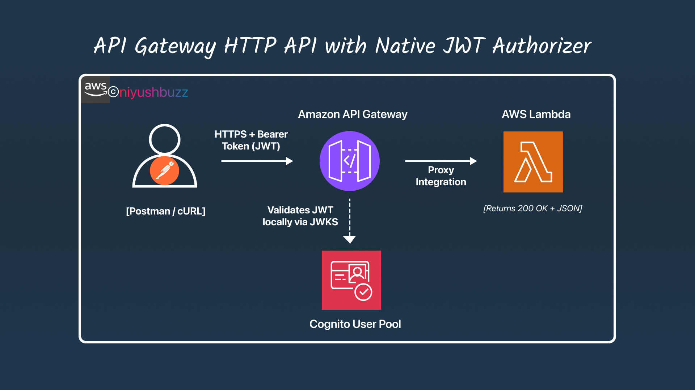

---

## **Step 1: Locate the Cognito JWKS and Issuer URLs**

> *Unlike REST APIs that use the Cognito Authorizer UI, HTTP APIs require the raw OIDC endpoints.*

1. Navigate to **Cognito** ➔ `api-security-lab-pool` ➔ **App integration**.
2. Scroll to the bottom to find the **Domain** URL (e.g., `https://apisec-lab-yourname-123.auth.ap-northeast-1.amazoncognito.com`).
3. Open a new browser tab and append `/oauth2/userInfo` to your domain just to verify it resolves (you will get a 401 or 400, which is fine, it proves the domain is active).
4. The **Issuer URL** for your HTTP API Authorizer will be the Cognito internal endpoint, NOT the custom domain. It follows this exact format:
`https://cognito-idp.ap-northeast-1.amazonaws.com/{YOUR_USER_POOL_ID}`*(Replace `ap-northeast-1` with your region, and `{YOUR_USER_POOL_ID}` with your actual Pool ID).*
5. 📝 **Copy this Issuer URL.**


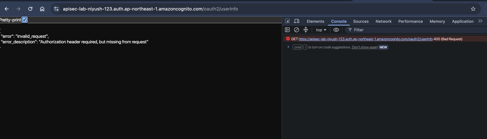
---

## **Step 2: Create the HTTP API**

1. Navigate to **API Gateway** ➔ **Create API**.
2. Under *HTTP API*, click **Build** (Do NOT click REST API).
3. Click **Add integration**.
    - *Integration type*: **Lambda**
    - *Lambda function*: `cognito-backend-mock` (Created in Lab 1).
    - *API name*: `CognitoSecureHTTP-API`
4. Click **Next**.
5. **Configure routes**:
    - *Method*: `GET`
    - *Path*: `/data`
    - *Integration*: `cognito-backend-mock`
6. Click **Next**.
7. **Review stages**:
    - *Stage name*: `$default` (Leave as default).
    - *Automatic deployment*: Enabled.
8. Click **Next**, then **Create**.
9. 📝 **Copy the Invoke URL** (e.g., `https://abc123.execute-api.ap-northeast-1.amazonaws.com`).

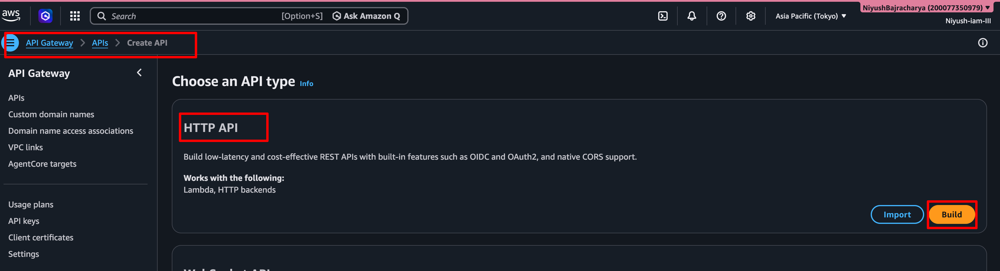

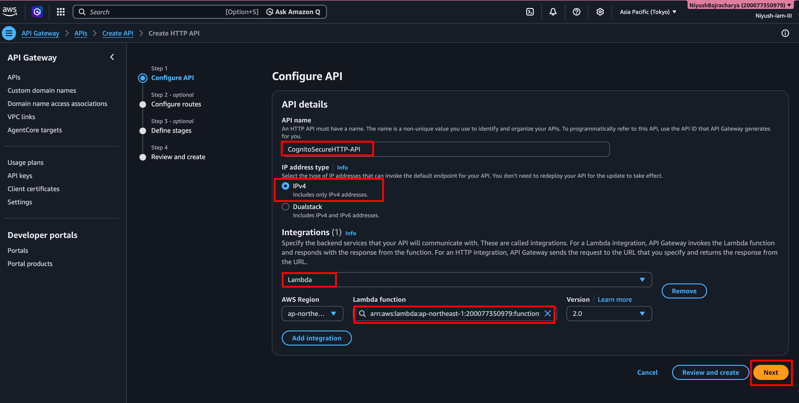

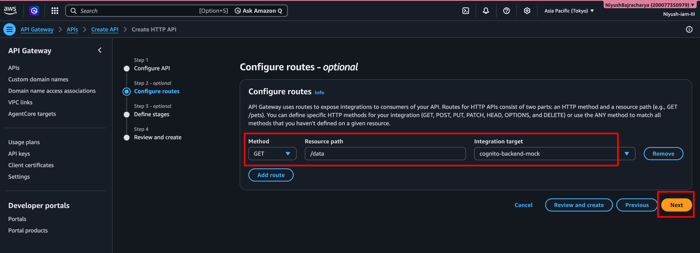

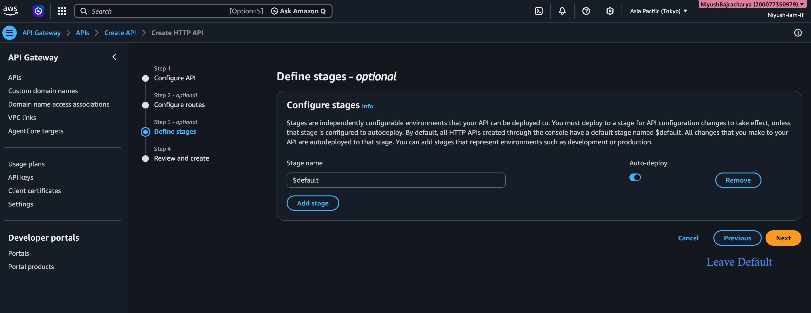

---

## **Step 3: Create the JWT Authorizer & Verification & Payload Inspection**


1. In the left pane of your new HTTP API, click **Authorizers** ➔ **Create authorizer**.
2. *Authorizer type*: Select **JWT**.
3. *Name*: `CognitoJWTAuth`
4. *JWT configuration*:
    - *Issuer URL*: Paste the `https://cognito-idp...` URL from Step 1.
    - *Audience*: Paste your **App Client ID** (from Phase 1, Lab 1).
5. Click **Create authorizer**.
6. Open Terminal.
7. Set method to **GET**, URL: `https://YOUR_HTTP_INVOKE_URL/data`.
8. Add Header: `Authorization` = `[PASTE_YOUR_ID_TOKEN_FROM_LAB_1]`.
9. Click **Send**.
10. ✅ **Expected Output:** `200 OK`.
11. **Inspect the Lambda Event Payload:**

```bash
curl -i -X GET "INVOKE URL" -H "Authorization : IDTOKEN"
```

>Modify your Lambda function slightly to print the raw event to CloudWatch logs so you can see the HTTP API payload structure:

sample code to update the lambda use this file
[python_code](../Lab%203:%20API%20Gateway%20HTTP%20API%20with%20Native%20JWT%20Authorizer/lamba_handler.py)


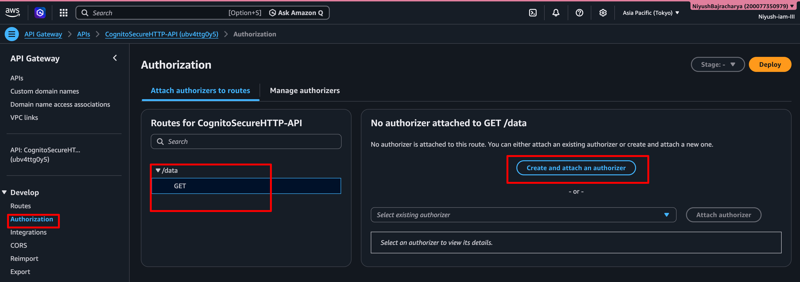

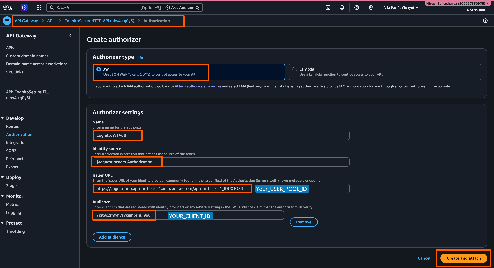

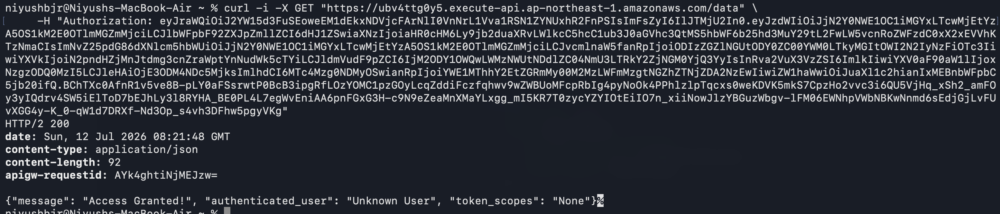

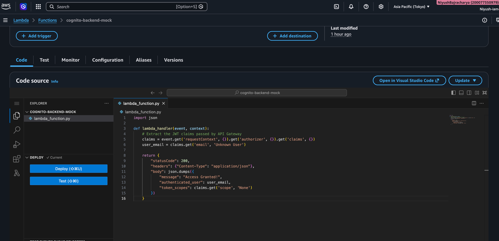

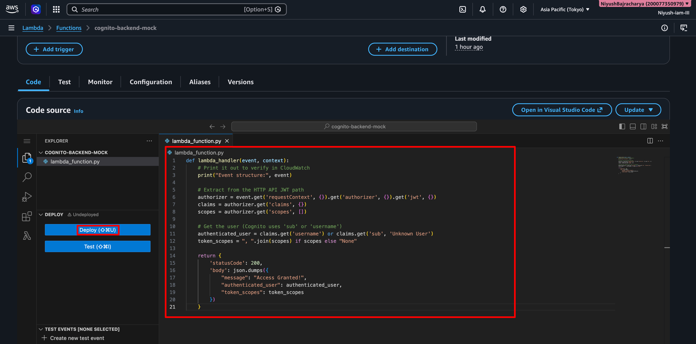

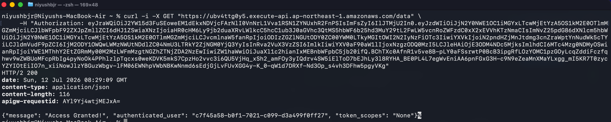

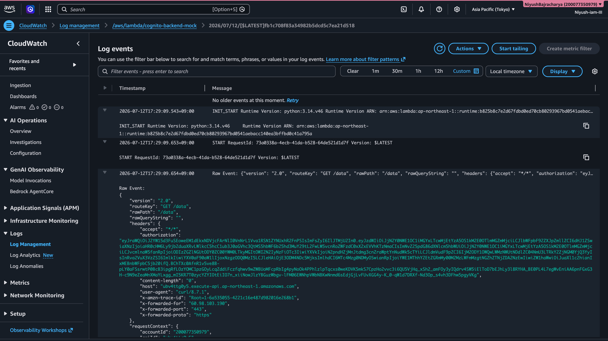

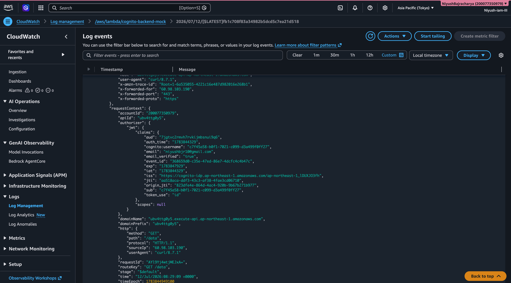


>And that’s a Wrapp for this Lab


## Step 4 : Delete resources Create

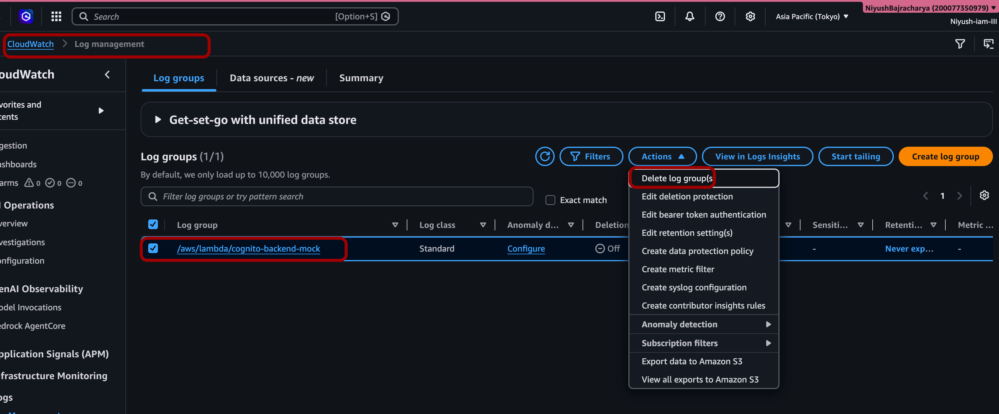

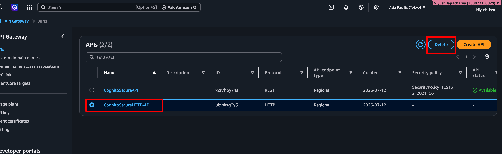

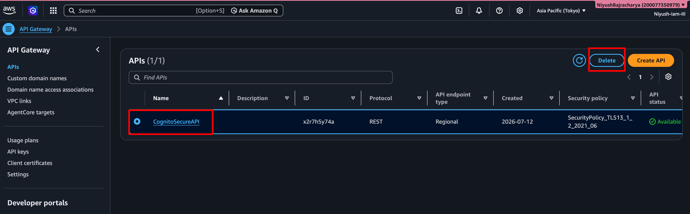

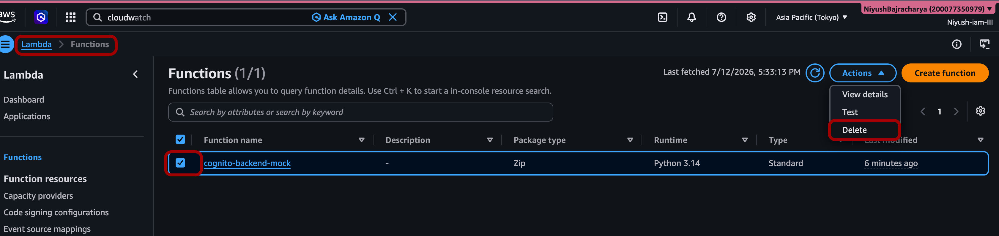

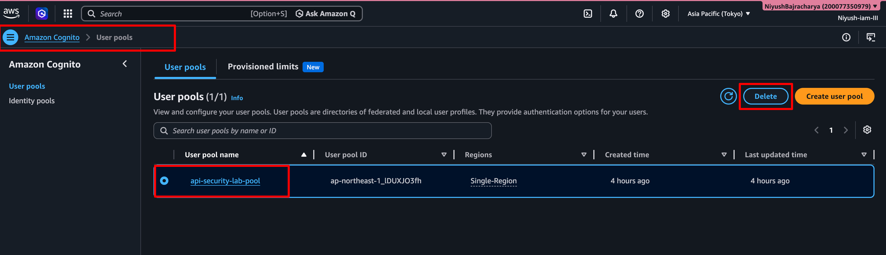

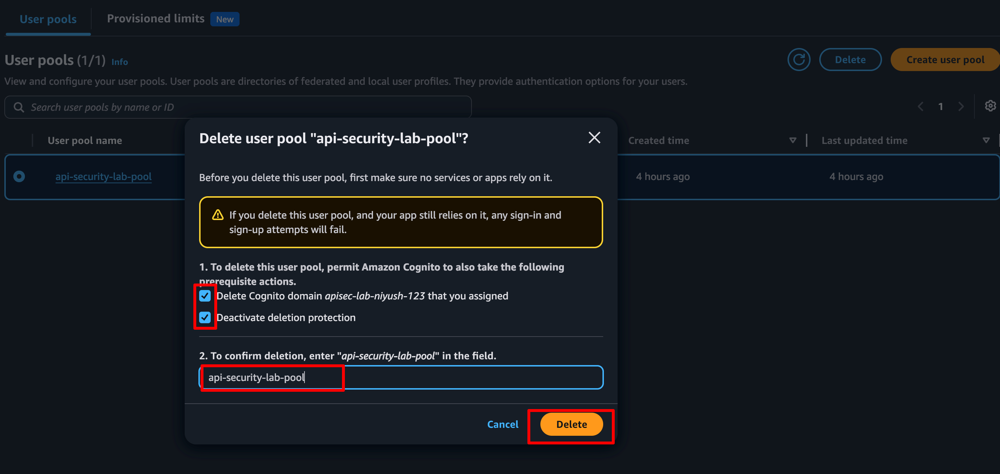

---

### **Lab 3 Summary**

| Component | Configuration Choice | Why it Matters |
| --- | --- | --- |
| **API Type** | HTTP API | Up to 71% cheaper than REST APIs. Optimized for serverless and microservices. |
| **Authorizer Type** | JWT | Validates tokens locally using the JWKS endpoint. Faster and cheaper than Lambda Authorizers. |
| **Audience Claim** | App Client ID | Ensures the token was specifically minted for *this* application, preventing cross-app token reuse. |

---

#### **Key Concepts Checklist (SAA-C03)**

- **HTTP API vs REST API:** HTTP APIs support JWT authorizers natively. REST APIs require the "Cognito User Pool" authorizer type or a custom Lambda authorizer. 🎯
- **Caching:** HTTP APIs do *not* support API Gateway caching for authorizer results (unlike REST APIs). However, JWT validation is cryptographically fast, so the performance hit is negligible.
- **Payload Mapping:** HTTP APIs use a simplified JSON payload format. Do not rely on REST API mapping templates (`$input.json()`) when using HTTP APIs.

---

#### **📝 Practice Exam Questions**

**Q5:** A media streaming company uses API Gateway to serve video metadata. They authenticate users via Amazon Cognito. They want to reduce API Gateway costs by 50% and simplify their authorization logic. They currently use a custom Lambda Authorizer to validate Cognito JWTs. What should the Solutions Architect recommend?
A) Switch to API Gateway HTTP APIs and configure a native JWT Authorizer pointing to the Cognito User Pool.
B) Keep REST APIs but enable API Gateway Caching for the Lambda Authorizer with a TTL of 300 seconds.
C) Migrate to Amazon CloudFront and use Lambda@Edge to validate the Cognito JWTs.
D) Switch to API Gateway HTTP APIs and use an IAM Authorizer with Cognito Identity Pools.

- Answer
    
    *Correct Answer: A. Explanation: HTTP APIs are significantly cheaper than REST APIs and support native JWT authorizers, eliminating the need for (and cost of) a custom Lambda Authorizer.*


