# Lab 4: Fine-Grained Authorization with Cognito Groups & Lambda

---

> ## What this project/Lab Aims
>   How to implement Role Based Access Control where different user roles (Admin vs Standard User) receive different permissions. We will use Cognito Groups to embed role metadata directly into the JWT, eliminating database lookups for authorization decisions.

---


### **Architecture Diagram:**

```markdown
[Admin User] ──(JWT with "cognito:groups": ["Admins"])──> [API Gateway]
      |                                                         |
      v                                                         v
[Lambda] <──(Reads claims.cognito:groups)── [Authorizer Passes Context]
      |
      ├── IF "Admins" in groups ➔ Return Full Dataset
      └── ELSE ➔ Return Restricted Dataset / 403 Forbidden
```

---


## Step 1 : Creating Cognito Groups

1. Navigate to **Cognito** ➔ `api-security-lab-pool`.
2. In the left pane, click **Groups** ➔ **Create group**.
3. *Group name*: `Admins`
4. *Description*: `Full access to all API resources`
5. *IAM role*: **(Leave Blank)** ⚠️ *Critical:* Only assign an IAM role if you are using Identity Pools for direct AWS resource access. For API Gateway authorization, we only need the group name in the JWT.
6. Click **Create group**.
7. Repeat steps 2-6 to create a second group named `StandardUsers`.


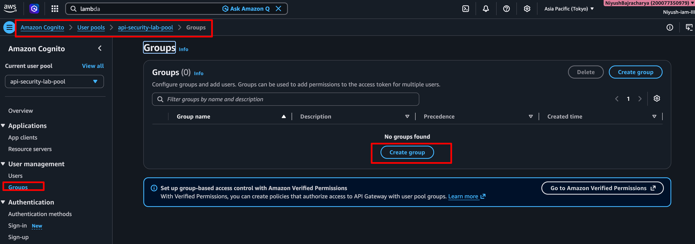

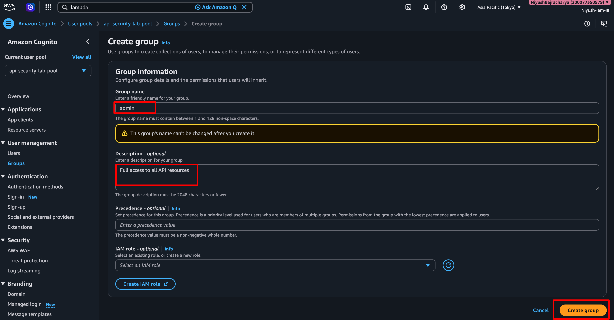

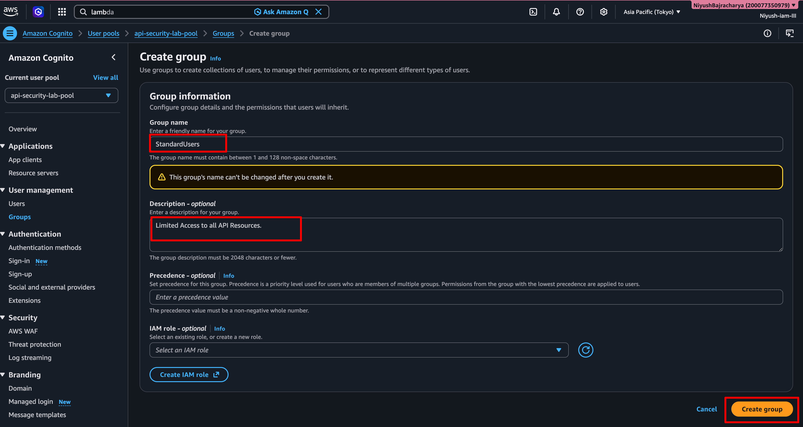

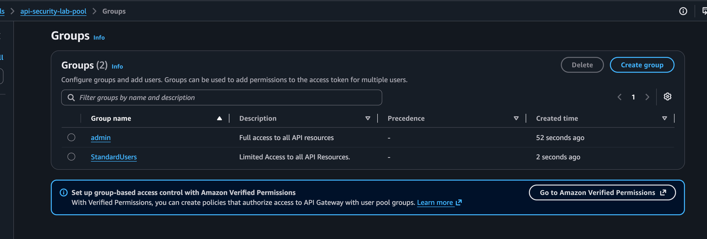
---

## **Step 2: Assign Users to Groups**

1. Click **Users** in the left pane.
2. Click on `testuser@example.com`.
3. Scroll to **Group memberships** ➔ **Add user to group**.
4. Select `StandardUsers` ➔ Click **Add to group**.
5. *(Optional)* Create a new user `admin@example.com` (follow Lab 1, Step 7 CLI commands) and add them to the `Admins` group.


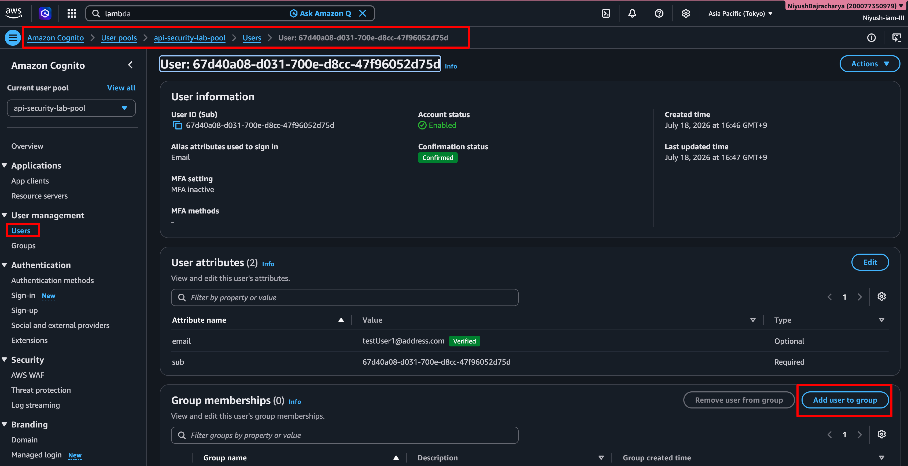

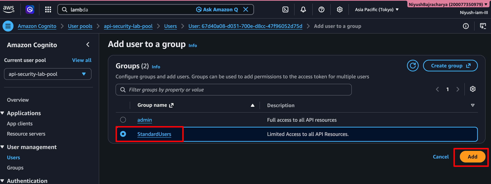

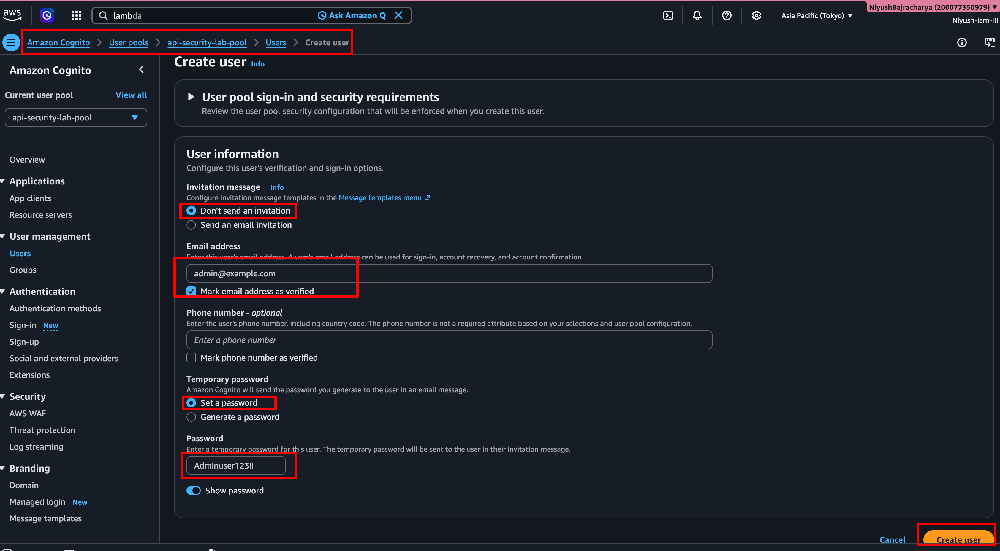

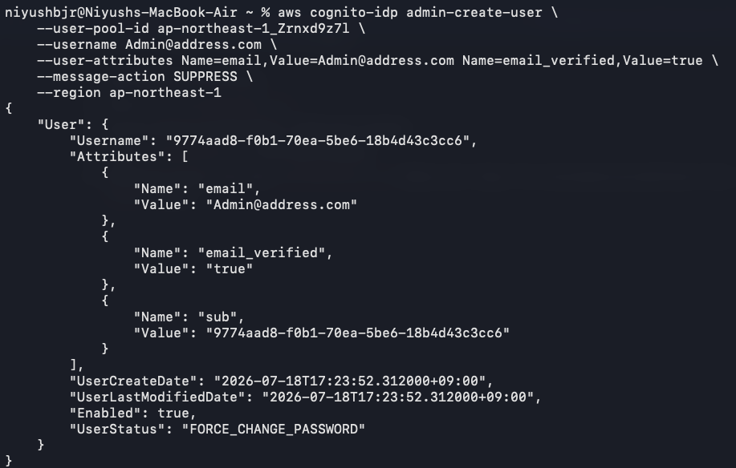

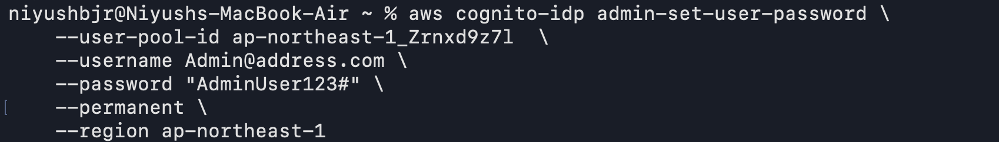

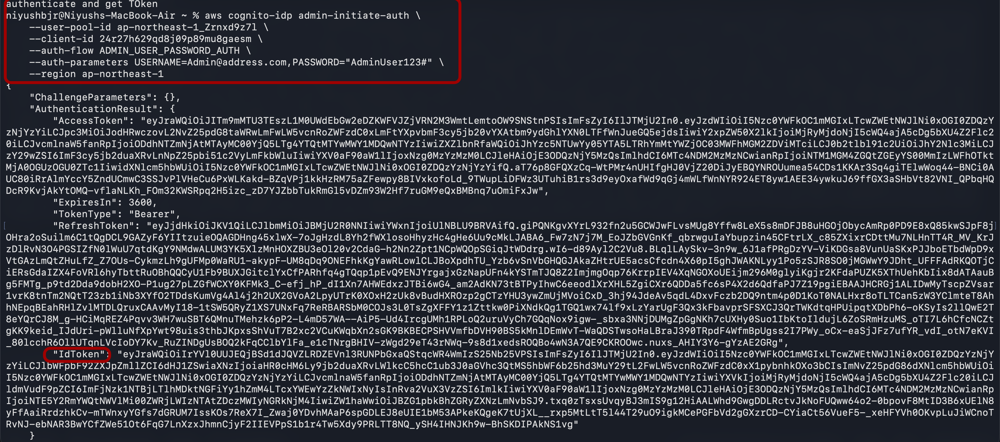

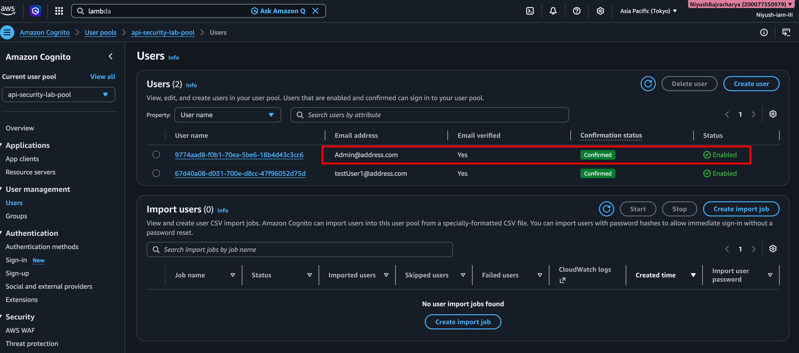

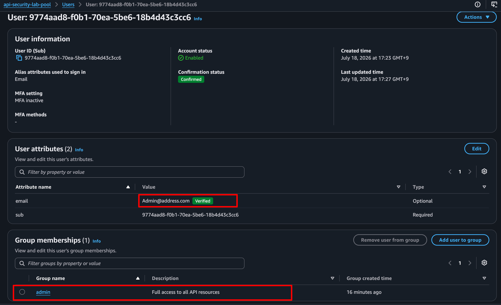

---

## **Step 3: Update Lambda for RBAC Logic**


1. Navigate to Lambda ➔ cognito-backend-mock. Update the code with this

[python_code_for_FIne_grainedAuth_REST_HTTP_Compatible](../Lab%204:Fine-Grained%20Authorization%20with%20Cognito%20Groups%20&%20Lambda/lambda_handler.py)

2. Click Deploy.

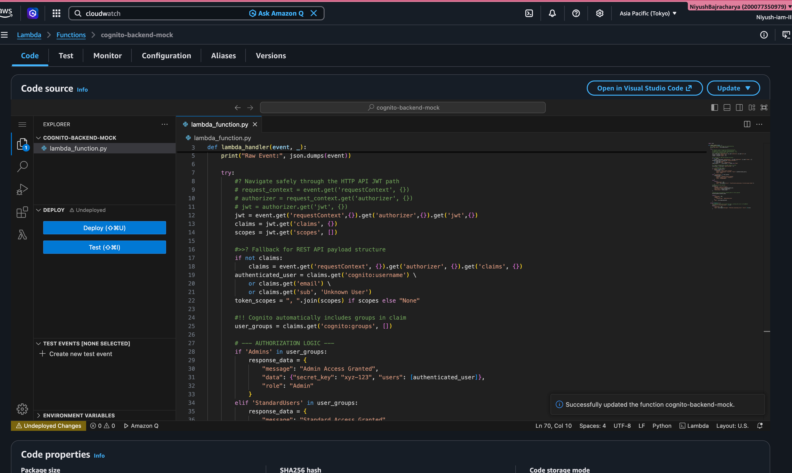


---

## **Step 4: Verification**


1. Authenticate as `testuser@example.com` (StandardUser) using the CLI command from Lab 1, Step 7.
2. Call the API with the new token.
✅ **Expected:** `200 OK` with `"role": "StandardUser"` and restricted data.
3. Authenticate as `admin@example.com` (Admin).
4. Call the API with the admin token.
✅ **Expected:** `200 OK` with `"role": "Admin"` and full dataset including `secret_key`.
5. Decode the JWT at jwt.io and verify the `cognito:groups` array contains the correct group name.

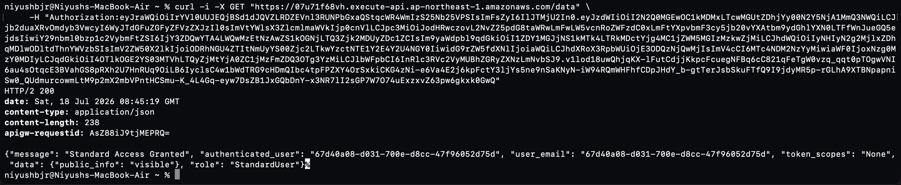

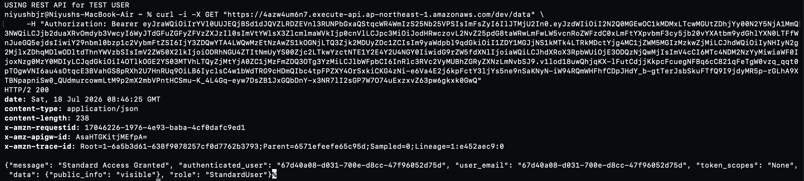

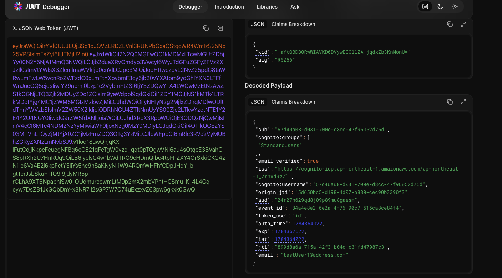

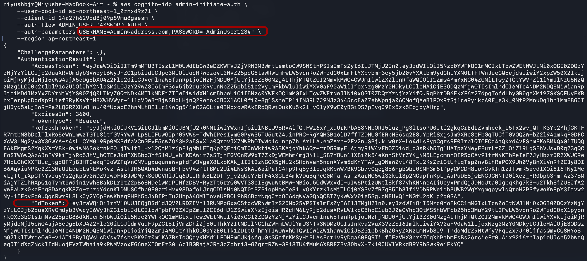

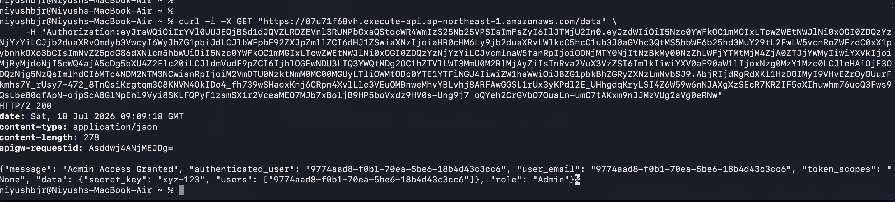

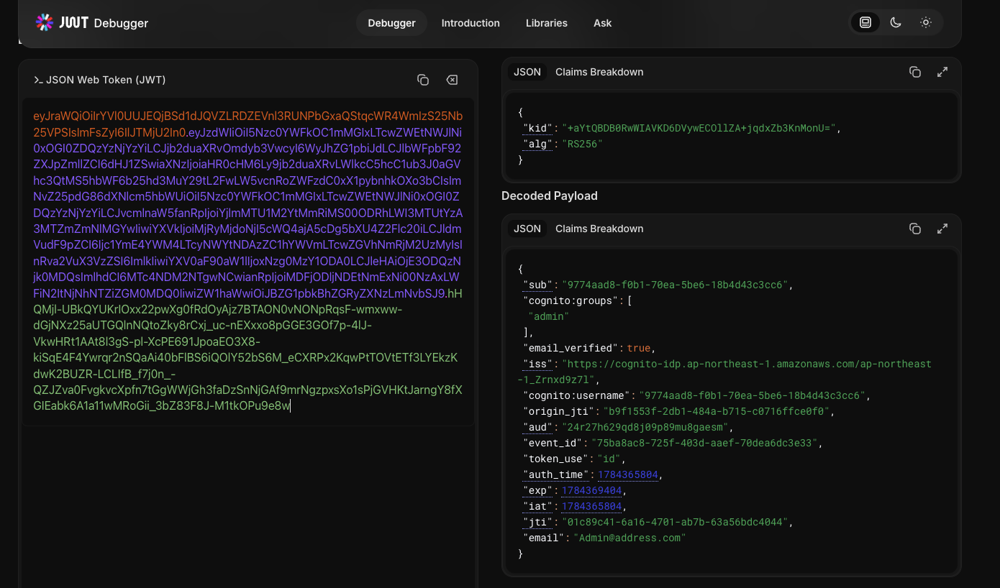


---

#### **Lab 4 Summary**

| Component | Configuration Choice | Why it Matters |
| --- | --- | --- |
| **Group Metadata** | Embedded in JWT | Eliminates DynamoDB/RDS lookup for every request. Reduces latency by 10-50ms per call. |
| **IAM Role on Group** | Left Blank | Prevents accidental privilege escalation. Groups should only be used for *app-level* authz, not *AWS-level* authz unless explicitly designed for Identity Pools. |
| **Claim Key** | `cognito:groups` | Standard OIDC claim injected by Cognito. Always check this key for RBAC logic. |

#### **🎯 Key Concepts Checklist (SAA-C03)**

- **Groups vs Custom Attributes:** Use Groups for *roles/permissions* (array-based, easy to manage). Use Custom Attributes for *profile data* (string-based, e.g., `tenant_id`, `department`). 🎯
- **Token Size Limit:** Cognito JWTs have a size limit. If users belong to >20 groups or have many custom attributes, the token may exceed HTTP header limits (8KB). Monitor token size in production.
- **Pre-Token Generation Trigger:** You can use a Lambda Trigger to dynamically modify/add groups or claims *before* the token is issued, enabling complex RBAC logic without storing it in the User Pool.

#### **📝 Practice Exam Questions**

**Q7:** A multi-tenant SaaS application uses Amazon Cognito for authentication. Each tenant has users with different roles (Viewer, Editor, Admin). The backend Lambda function needs to enforce these roles without querying a database on every request. What is the MOST efficient solution?
A) Store role mappings in DynamoDB and use a Lambda Authorizer to query it before invoking the backend Lambda.
B) Create Cognito Groups for each role and assign users to groups. Read the `cognito:groups` claim in the backend Lambda.
C) Use Cognito Custom Attributes to store the role string and validate it in API Gateway mapping templates.
D) Issue separate App Clients for each role and use different API Gateway stages.

*Correct Answer: B. Explanation: Cognito Groups are natively embedded in the JWT as the `cognito:groups` claim. This provides zero-latency authorization without additional database calls or custom authorizer overhead.*


