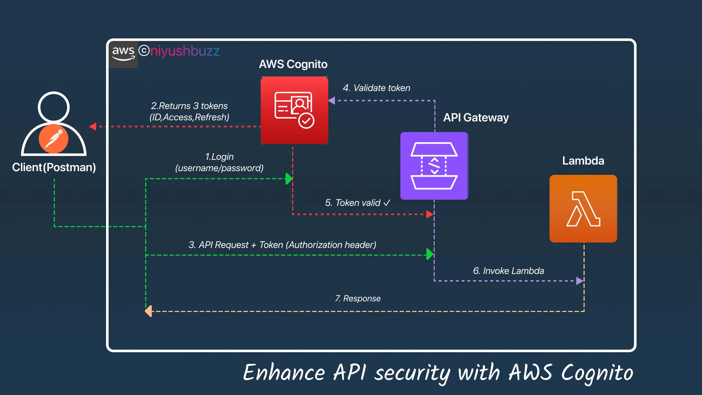

## Enhancing API Security with Amazon Cognito

---

## ⌘ Overall Architecture

   

---
### **Cost Overview (Before You Start)**

| Service | Pricing Model (ap-northeast-1) | Estimated Lab Cost | Cost Warning / Optimization |
| --- | --- | --- | --- |
| **Amazon Cognito** | $0.0055 per MAU (Free for first 50k MAUs) | **$0.00** | Free tier covers manual testing easily. |
| **API Gateway (REST)** | $1.29 per 1M requests | **<$0.01** | Do not leave open to the internet without throttling to avoid DDoS billing spikes. |
| **AWS Lambda** | $0.20 per 1M requests + Compute time | **<$0.01** | Use 128MB RAM and keep execution time <1s. |

---

### **Service Comparison & Decision Framework**

When designing API security, you must choose the right authorization mechanism. Cognito is not always the answer.

| Feature | Amazon Cognito User Pools | Lambda Authorizer (Custom) | API Gateway IAM Auth | AWS IAM Identity Center |
| --- | --- | --- | --- | --- |
| **Primary Use Case** | B2C / B2B App Users (OIDC/OAuth2) | Custom logic, legacy DB validation | Service-to-Service (M2M) / Internal APIs | Internal Workforce / Employees |
| **Token Type** | JWT (OIDC ID Token / Access Token) | Custom JSON / JWT | AWS Signature V4 | SAML / OIDC |
| **Setup Effort** | Low (Managed Service) | High (Write & maintain code) | Low (IAM Policies) | Medium (Directory setup) |
| **Caching** | N/A (Validation is fast) | **Yes** (TTL up to 1hr, saves $) | N/A | N/A |
| **Cost** | Per MAU | Per Lambda invocation + API GW | Free (IAM is free) | Free for IAM Identity Center |