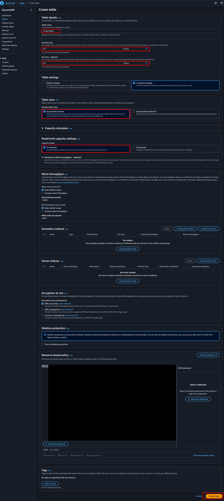
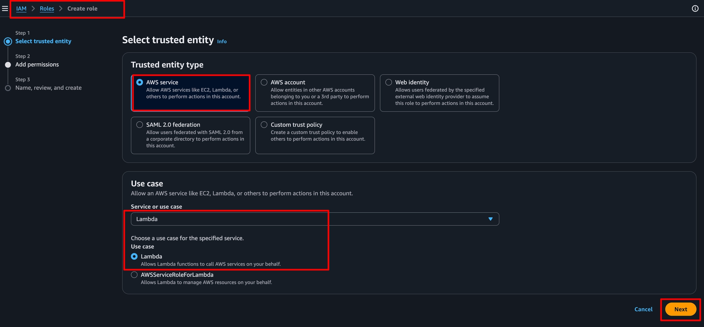
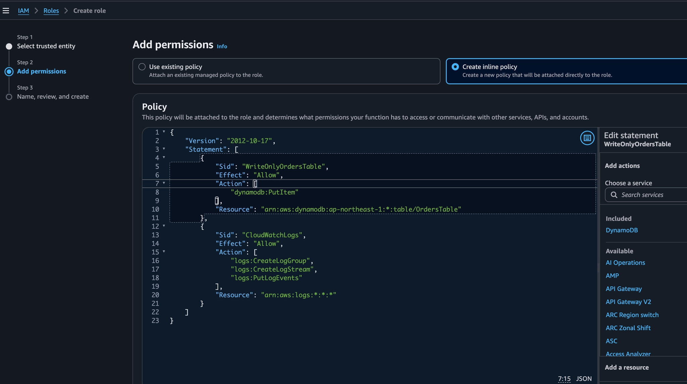
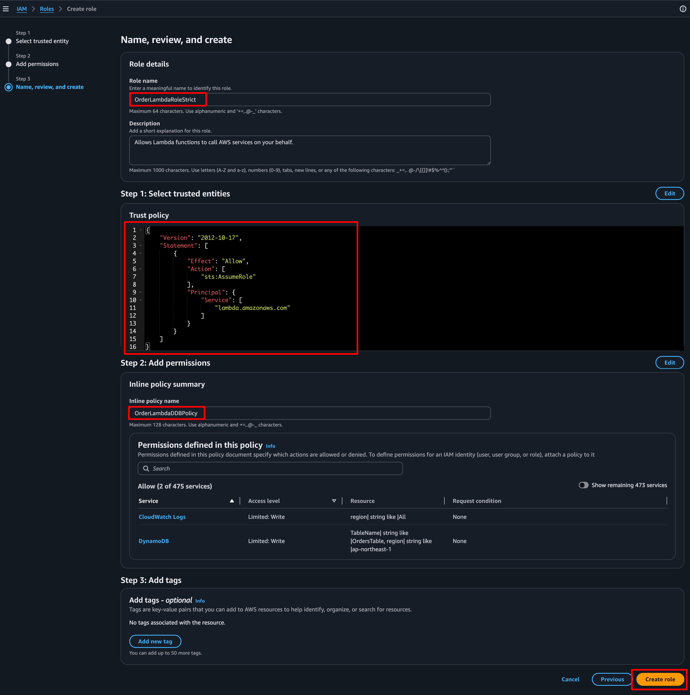

# Lab 1: Idempotent API Gateway -> Lambda -> Advanced DynamoDB

---


#### **What You'll Learn**

- Implement API Gateway JSON Schema validation (Reject malformed payloads at the edge).
- Implement DynamoDB **Conditional Writes** to guarantee idempotency.
- Design a DynamoDB table using **Single-Table Design** (Generic **`PK`**/**`SK`**).
- Write a strict, least-privilege IAM policy for Lambda.

---

### Architecture Diagram
```markdown
┌─────────────────────────────────────────────────────────────────────┐
│  USER (terminal/ curl) - Sends Header: "Idempotency-Key: abc-123"   │
│    │                                                                │
│    v                                                                │
│  ┌────────────────────────────────────────────────────────────────┐ │
│  │ API Gateway (HTTP API)                                         │ │
│  │  1. JSON Schema Validation (Rejects bad payloads -> 400 Error) │ │
│  └─────────────────────────┬──────────────────────────────────────┘ │
│                            │ (Valid JSON only)                      │
│                            v                                        │
│  ┌────────────────────────────────────────────────────────────────┐ │
│  │ AWS Lambda (Python 3.12)                                       │ │
│  │  1. Extracts Idempotency-Key from headers                      │ │
│  │  2. Generates orderId                                          │ │
│  │  3. PutItem with ConditionExpression (attribute_not_exists)    │ │
│  └─────────────────────────┬──────────────────────────────────────┘ │
│                            │                                        │
│                            v                                        │
│  ┌────────────────────────────────────────────────────────────────┐ │
│  │ DynamoDB Table: Orders (Single-Table Design)                   │ │
│  │  PK: customerId#<id>  (e.g., cust_001)                         │ │
│  │  SK: order#<uuid>                                              │ │
│  │  IdempotencyKey: <uuid> (Used for conditional check)           │ │
│  └────────────────────────────────────────────────────────────────┘ │
└─────────────────────────────────────────────────────────────────────┘
```

---

### **Step 1 — Create the DynamoDB Table (Single-Table Design)**

> 💡 *Why Generic PK/SK?* In Single-Table Design, we use generic names (**`PK`** / **`SK`**) so we can store multiple entity types (Customers, Orders, LineItems) in the same table and query them efficiently using GSIs. This is the hallmark of advanced DynamoDB.

1. Console path: **DynamoDB → Tables → Create table**
2. Table details:
    - Table name: **`OrdersTable`**
    - Partition key: **`PK`** (String)
    - Sort key: **`SK`** (String)
3. Table settings: **Customized settings**
    - Capacity mode: **On-Demand**
4. Click **Create table**.
5. Go to **Backups** tab -> **Enable** PITR.
6. Go to **Table** tab -> **Time to Live (TTL)** -> Attribute name: **`expireAt`** -> **Enable**.

**Enable PITR (Point-in-Time Recovery):**

1. Click on your **`OrdersTable`** name.
2. Go to the **Backups** tab.
3. Under Point-in-time recovery, click **Enable**.
    
    > 💡 *Why?* PITR gives you continuous backups for the last 35 days. You can restore to *any* second in the last 35 days. It costs 20% of your regional DynamoDB price, but for a 2-hour lab, it's pennies. It is the ONLY DynamoDB backup mechanism that protects against accidental **`DELETE`** commands.
    > 

**Enable TTL (Time-to-Live):**

1. Go to the **Table** tab, scroll to **Time to Live (TTL)** section, click **Enable**.
2. TTL attribute name: **`expireAt`** (must be a Number, representing Unix epoch time in seconds).
3. Click **Enable TTL**.
    
    > 💡 *Why?* TTL lets you expire items automatically without consuming Write Capacity Units (WCUs). Common use case: Shopping carts that expire after 7 days. The DynamoDB background process deletes the item, and it's removed from indexes and streams.
    >



---

### **Step 2 — Create the Strict IAM Role (Least Privilege)**

> Instead of **`AmazonDynamoDBFullAccess`**, we will write a policy that only allows Lambda to write to this specific table, and only via **`PutItem`**.
>

1. Console path: **IAM → Roles → Create role** -> **AWS Service** -> **Lambda**.
2. Permissions: Click **Create policy**. Go to the **JSON** tab and paste the code from [OrderLambdaDDBPolicy](OrderLambdaDDBPolicy.json)

> 💡 *Why this matters:* If this Lambda is compromised, the attacker cannot delete the table, cannot read other customers' orders, and cannot scan the table. They can *only* add new items. This is a critical SAA-C03 security concept
> 
3. Name the policy: **`OrderLambdaDDBPolicy`**. Create it.
4. Back in the Role creation, search for and attach **`OrderLambdaDDBPolicy`**.
3. Also attach **`AWSLambdaBasicExecutionRole`** (for logging).
4. Role name: **`OrderLambdaRoleStrict`**. Click **Create role**.







---