# Lab 1: Idempotent API Gateway -> Lambda -> Advanced DynamoDB

---


#### **What You'll Learn**

- Implement API Gateway JSON Schema validation (Reject malformed payloads at the edge).
- Implement DynamoDB **Conditional Writes** to guarantee idempotency.
- Design a DynamoDB table using **Single-Table Design** (Generic **`PK`**/**`SK`**).
- Write a strict, least-privilege IAM policy for Lambda.

---

### Architecture Diagram
```markdown
┌─────────────────────────────────────────────────────────────────────┐
│  USER (terminal/ curl) - Sends Header: "Idempotency-Key: abc-123"   │
│    │                                                                │
│    v                                                                │
│  ┌────────────────────────────────────────────────────────────────┐ │
│  │ API Gateway (HTTP API)                                         │ │
│  │  1. JSON Schema Validation (Rejects bad payloads -> 400 Error) │ │
│  └─────────────────────────┬──────────────────────────────────────┘ │
│                            │ (Valid JSON only)                      │
│                            v                                        │
│  ┌────────────────────────────────────────────────────────────────┐ │
│  │ AWS Lambda (Python 3.12)                                       │ │
│  │  1. Extracts Idempotency-Key from headers                      │ │
│  │  2. Generates orderId                                          │ │
│  │  3. PutItem with ConditionExpression (attribute_not_exists)    │ │
│  └─────────────────────────┬──────────────────────────────────────┘ │
│                            │                                        │
│                            v                                        │
│  ┌────────────────────────────────────────────────────────────────┐ │
│  │ DynamoDB Table: Orders (Single-Table Design)                   │ │
│  │  PK: customerId#<id>  (e.g., cust_001)                         │ │
│  │  SK: order#<uuid>                                              │ │
│  │  IdempotencyKey: <uuid> (Used for conditional check)           │ │
│  └────────────────────────────────────────────────────────────────┘ │
└─────────────────────────────────────────────────────────────────────┘
```

---

### **Step 1 — Create the DynamoDB Table (Single-Table Design)**

> 💡 *Why Generic PK/SK?* In Single-Table Design, we use generic names (**`PK`** / **`SK`**) so we can store multiple entity types (Customers, Orders, LineItems) in the same table and query them efficiently using GSIs. This is the hallmark of advanced DynamoDB.

1. Console path: **DynamoDB → Tables → Create table**
2. Table details:
    - Table name: **`OrdersTable`**
    - Partition key: **`PK`** (String)
    - Sort key: **`SK`** (String)
3. Table settings: **Customized settings**
    - Capacity mode: **On-Demand**
4. Click **Create table**.
5. Go to **Backups** tab -> **Enable** PITR.
6. Go to **Table** tab -> **Time to Live (TTL)** -> Attribute name: **`expireAt`** -> **Enable**.

**Enable PITR (Point-in-Time Recovery):**

1. Click on your **`OrdersTable`** name.
2. Go to the **Backups** tab.
3. Under Point-in-time recovery, click **Enable**.
    
    > 💡 *Why?* PITR gives you continuous backups for the last 35 days. You can restore to *any* second in the last 35 days. It costs 20% of your regional DynamoDB price, but for a 2-hour lab, it's pennies. It is the ONLY DynamoDB backup mechanism that protects against accidental **`DELETE`** commands.
    > 

**Enable TTL (Time-to-Live):**

1. Go to the **Table** tab, scroll to **Time to Live (TTL)** section, click **Enable**.
2. TTL attribute name: **`expireAt`** (must be a Number, representing Unix epoch time in seconds).
3. Click **Enable TTL**.
    
    > 💡 *Why?* TTL lets you expire items automatically without consuming Write Capacity Units (WCUs). Common use case: Shopping carts that expire after 7 days. The DynamoDB background process deletes the item, and it's removed from indexes and streams.
    >


---

### **Step 2 — Create the Strict IAM Role (Least Privilege)**

> Instead of **`AmazonDynamoDBFullAccess`**, we will write a policy that only allows Lambda to write to this specific table, and only via **`PutItem`**.
>

1. Console path: **IAM → Roles → Create role** -> **AWS Service** -> **Lambda**.
2. Permissions: Click **Create policy**. Go to the **JSON** tab and paste the code from [OrderLambdaDDBPolicy](OrderLambdaDDBPolicy.json)

> 💡 *Why this matters:* If this Lambda is compromised, the attacker cannot delete the table, cannot read other customers' orders, and cannot scan the table. They can *only* add new items. This is a critical SAA-C03 security concept
> 
3. Name the policy: **`OrderLambdaDDBPolicy`**. Create it.
4. Back in the Role creation, search for and attach **`OrderLambdaDDBPolicy`**.
3. Also attach **`AWSLambdaBasicExecutionRole`** (for logging).
4. Role name: **`OrderLambdaRoleStrict`**. Click **Create role**.


---

### **Step 3 — Create the Idempotent AWS Lambda Function**

1. Console path: **Lambda → Functions → Create function**
2. Choose **Author from scratch**.
3. Basic information:
    - Function name: **`PostOrderFunction`**
    - Runtime: **Python 3.12**
    - Architecture: **x86_64**
    - Execution role: **Use an existing role** -> select `OrderLambdaRoleStrict`.
4. Click **Create function**.
5. Scroll down to the **Code source** editor. Replace the default code with the code in this file [PostOrderFunction](./PostOrderFunction.py)

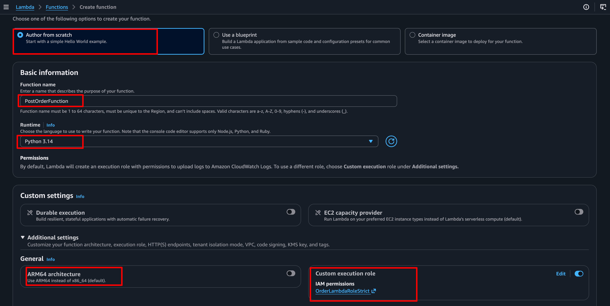

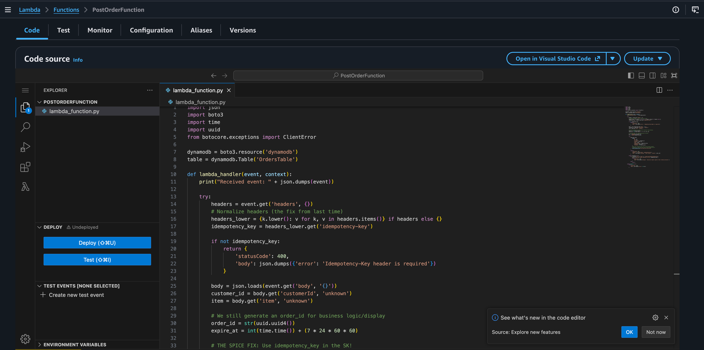

---
### **Step 4 — Create API Gateway with Request Validation**

Instead of letting Lambda parse JSON and fail (costing you money), we will configure API Gateway to reject anything that doesn't match our schema.

1. Console path: **API Gateway → APIs → Create API** -> Choose **REST API** (Build).
    - *Wait, why REST API instead of HTTP API?* Because HTTP APIs do not support native request validation. REST API costs $3.50/mo per 1M reqs, but for an enterprise API that validates payloads at the edge, it's worth it.
2. Name: **`OrdersAPI`**. Endpoint Type: **Regional**. Click **Create API**.
3. Click **Resources** -> **Create resource**. Path: **`orders`**. Click **Create resource**.
4. Click **Method** -> Choose **POST**. Integration: **Lambda Function** -> **`PostOrderFunction`**. Click **Create method**.
5. **The Spice (Validation):** Click on the **POST** method. Click the **Method request** tab.
6. Under **Request validator**, click edit. Select **Validate body**.
7. Under **Request body**, click edit. Add a model:
    - Content type: **`application/json`**
    - Model name: **`OrderModel`**
    - Description: **`Validates order payload`**
    - Schema (paste this JSON Schema):
    - sample Schema
        
        ```json
        {
          "$schema": "http://json-schema.org/draft-04/schema#",
          "title": "Order",
          "type": "object",
          "properties": {
            "customerId": { "type": "string" },
            "item": { "type": "string" }
          },
          "required": ["customerId", "item"]
        }
        ```
        
8. Save the model and the method request.
9. Click **Deploy API**. Create a new Stage called **`prod`**. Deploy.
10. Note the **Invoke URL** (e.g., **`https://abc123.execute-api.ap-northeast-1.amazonaws.com/prod`**).

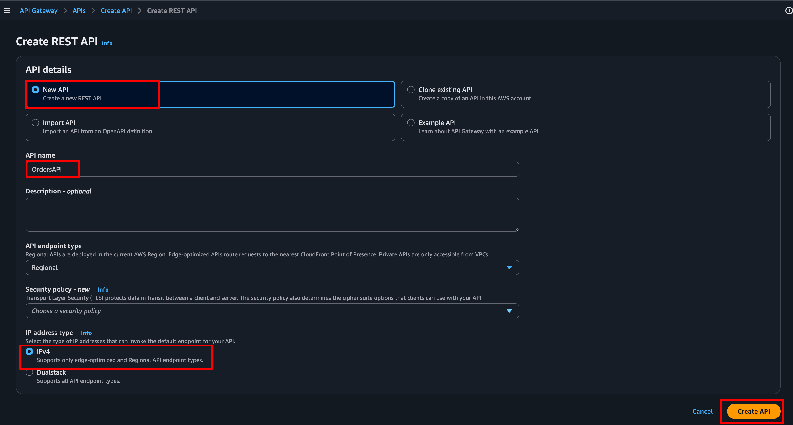

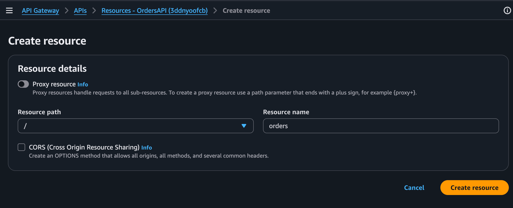

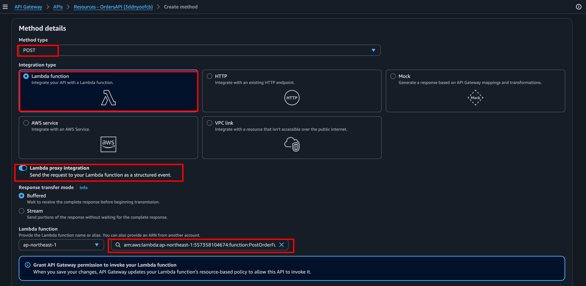

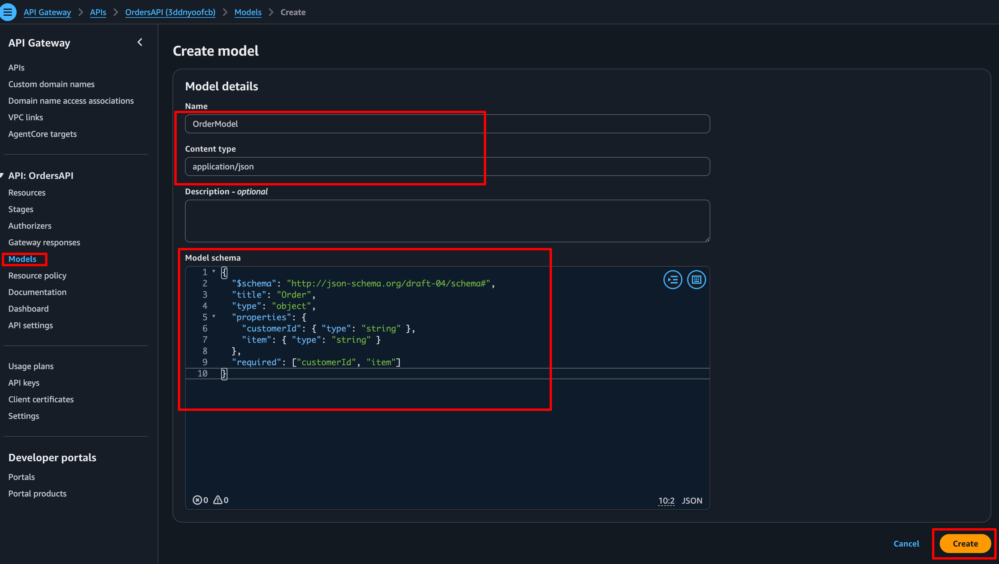

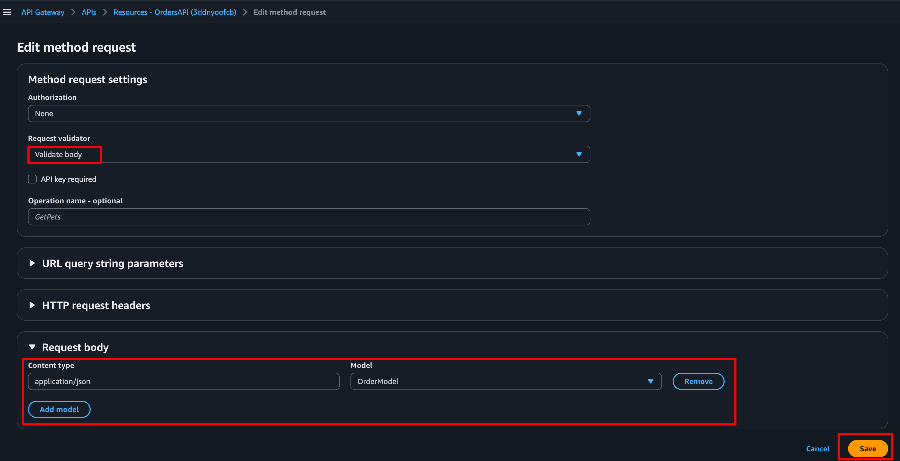

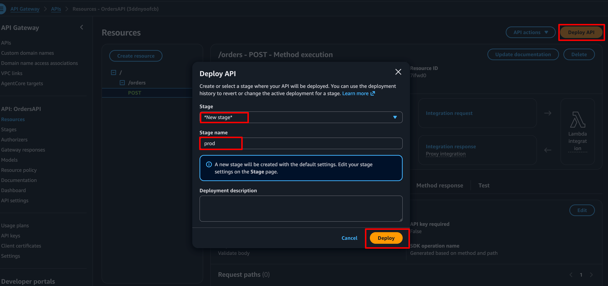


---

### **Step 5 — Test the Spice (Idempotency & Validation)**

Open your terminal and use **`curl`** to send a POST request to the API URL.

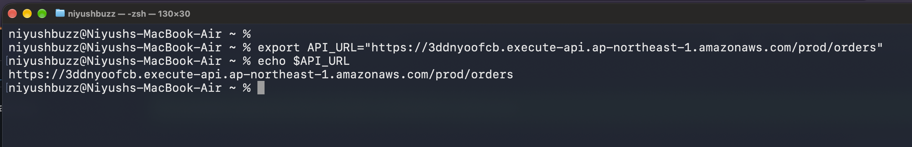

#### **Test 1: Missing Payload (Should be rejected by API Gateway)**

```bash
# Replace the URL with your API Gateway Invoke URL
export API_URL="https://abc123.execute-api.ap-northeast-1.amazonaws.com/prod/orders"

curl -s -X POST $API_URL \
  -H "Content-Type: application/json" \
  -H "Idempotency-Key: key-001" \
  -d '{"customerId": "cust_001"}' 
 
 # Expected Output: {"message": "Invalid request body"}
```

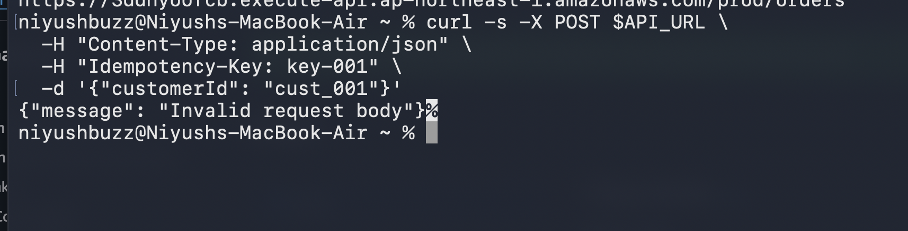

---

#### **Test 2: Valid First Request (Should succeed)**

```bash
curl -s -X POST $API_URL \
  -H "Content-Type: application/json" \
  -H "Idempotency-Key: key-001" \
  -d '{"customerId": "cust_001", "item": "MacBook Pro"}' 

# Expected Output: {"message": "Order placed", "orderId": "1234-..."}
```
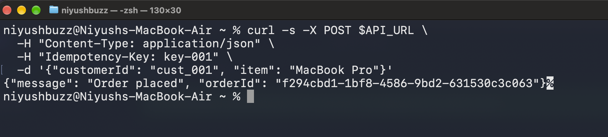

---

#### **Test 3: Duplicate Request (Should be ignored by DynamoDB Conditional Write)**

```bash
curl -s -X POST $API_URL \
  -H "Content-Type: application/json" \
  -H "Idempotency-Key: key-001" \
  -d '{"customerId": "cust_001", "item": "MacBook Pro"}' 
 
 # Expected Output: {"message": "Duplicate request ignored. Order already processed."}
 # Go to the DynamoDB console. You will see only one item in your table, despite two valid requests being sent. You just built a production-grade, fault-tolerant API.
```

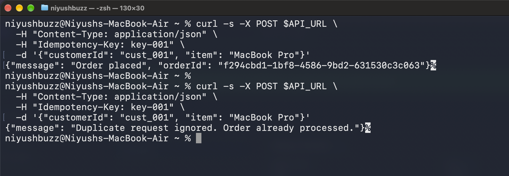

---


## Why This Architecture Wins
1. **Idempotency**: Network requests fail. Users double-click. By using **`ConditionExpression='attribute_not_exists(idempotencyKey)'`**, DynamoDB atomically guarantees that a duplicate request never overwrites or creates a second order. This is how Stripe and PayPal handle payments.
2. **API Gateway Validation**: By rejecting malformed JSON at the edge, API Gateway returns a 400 error in 2ms. Lambda is never invoked. You pay $0 for compute. If you did this in Lambda, you'd pay for the Lambda execution time to parse the JSON and fail.
3. **Single-Table Design**: By using **`PK`** and **`SK`** instead of **`customerId`** and **`orderId`**, we can later add a GSI with **`PK=item`** to query all orders for a specific item without creating a new table.
4. **Strict IAM**: If an attacker finds a way to exploit your Lambda, they can only *add* garbage data. They cannot read your customer database or delete the table.

---

#### **Key Concepts (SAA-C03 Memorize)**

- 🎯 **Idempotency**: The ability to process the same request multiple times without changing the final state. Use DynamoDB conditional writes to implement it.
- 🎯 **Conditional Writes**: **`ConditionExpression`** is the DynamoDB way to do Optimistic Concurrency Control. It prevents lost updates in concurrent environments.
- 🎯 **API Gateway Validation**: REST APIs support JSON Schema validation; HTTP APIs do not. If the exam asks how to reject bad payloads before hitting Lambda, use REST API with Request Validator.
- 🎯 **Single-Table Design**: Using generic **`PK`**/**`SK`** attributes. Allows for sparse indexes, overloading, and highly efficient queries.

---
