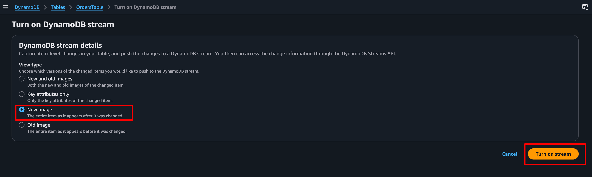
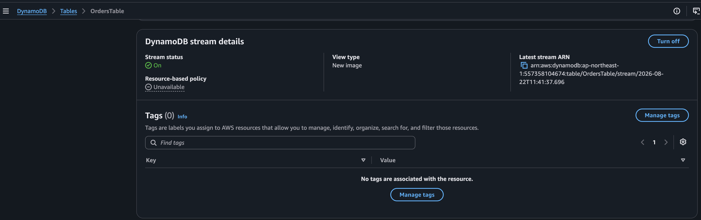
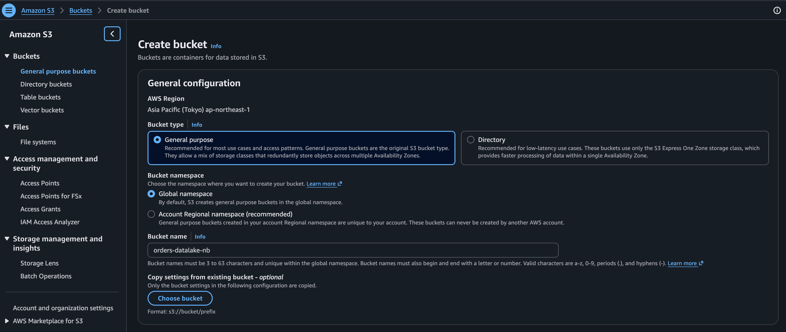
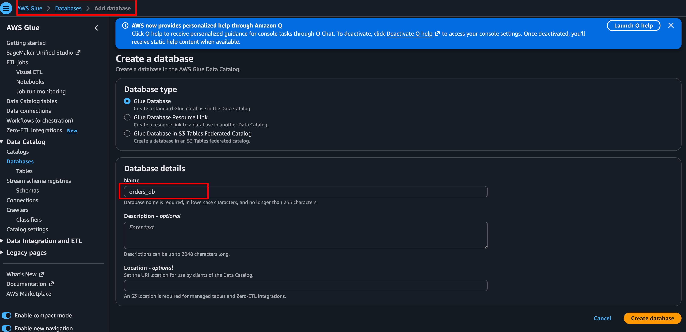
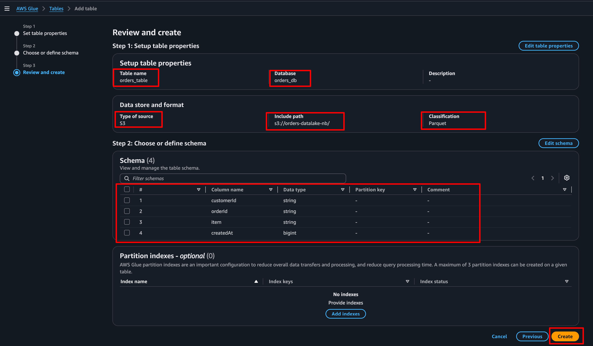
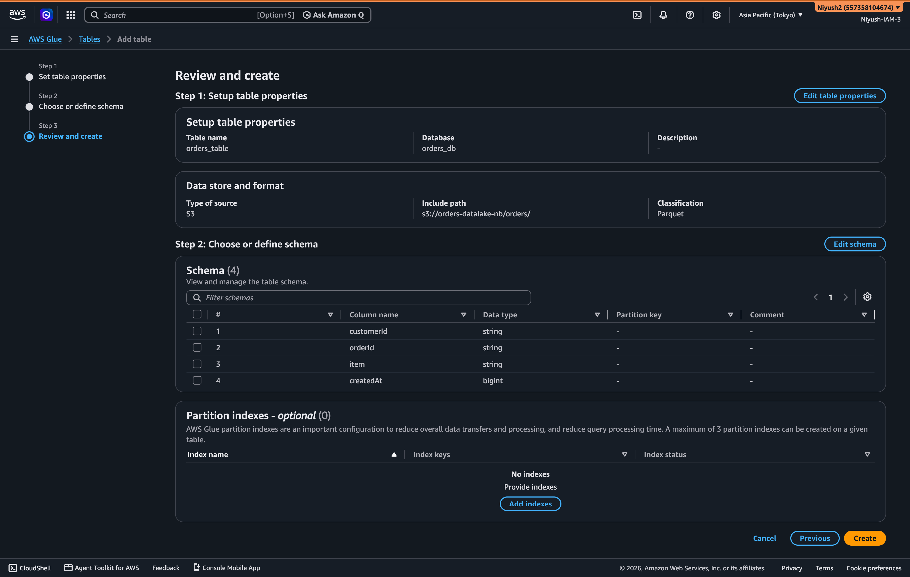

# Lab 2: DynamoDB Streams -> Firehose Lambda Transform -> S3 (Parquet) -> Athena

---

#### **What You'll Learn**

- Enable DynamoDB Streams for Change Data Capture (CDC).
- Configure Kinesis Data Firehose to consume from DynamoDB Streams.
- Deploy a Firehose Transformation Lambda to clean and enrich the data.
- Use Firehose + Glue Catalog to write columnar Parquet files to S3.
- Query the data lake using Amazon Athena.

---

### **Architecture Diagram**

```markdown
┌─────────────────────────────────────────────────────────────────────┐
│  Phase 1 (Existing)         │  Phase 2 (New Analytics Pipeline)     │
│                             │                                       │
│  ┌─────────────────┐        │   ┌────────────────────┐              │
│  │ API Gateway     │        │   │ AWS Glue Data      │ (Schema)     │
│  └────────┬────────┘        │   │ Catalog Database   │              │
│           v                 │   └─────────┬──────────┘              │
│  ┌─────────────────┐        │             │ Schema Ref              │
│  │ DynamoDB        │        │             v                         │
│  │ Table: Orders   │───────>│   ┌──────────────────────┐            │
│  │ (PITR + TTL)    │ Stream │   │ Kinesis Firehose     │            │
│  └────────┬────────┘ (CDC)  │   │  - JSON Buffer       │            │
│           │                 │   │  - Lambda Transform  │ (Flatten)  │
│           v                 │   │  - Parquet Convert   │ (Native)   │
│  ┌─────────────────┐        │   └─────────┬────────────┘            │
│  │ Lambda Function │        │             │                         │
│  │ (Ingestion)     │        │             v                         │
│  └─────────────────┘        │   ┌─────────────────────┐             │
│                             │   │ Amazon S3           │             │
│                             │   │ Data Lake (Parquet) │             │
│                             │   └─────────┬───────────┘             │
│                             │             │                         │
│                             │             v                         │
│                             │   ┌────────────────────┐              │
│                             │   │ Amazon Athena      │ (SQL Query)  │
│                             │   └────────────────────┘              │
└─────────────────────────────────────────────────────────────────────┘
```

---

### **Step 1 — Enable DynamoDB Streams**

1. Console path: **DynamoDB → Tables → `OrdersTable` → Exports and streams tab**.
2. Scroll to **DynamoDB stream details**, click **Enable**.
3. Stream type: **New image** 
(we only care about the data *after* it was written, not the old state).
4. Click **Enable stream**.
5. Note the **Stream ARN**

> 💡 **Why DDB Streams vs Kinesis Streams?** DDB Streams is purpose-built for DynamoDB. It guarantees exactly-once processing and 1:1 ordering per item, which Kinesis Data Streams does not. DDB Streams has a 24-hour retention limit (SAA-C03 trap!).
>
<br>





---

### **Step 2 — Create the S3 Data Lake Bucket**

1. Console path: **S3 → General purpose buckets → Create bucket**
2. Bucket name: **`orders-datalake-<your-initials>`** (must be globally unique).
3. Region: **ap-northeast-1**.
4. Block *all* public access: ✅.
5. Default encryption: **SSE-S3**.
6. Click **Create bucket**.



---
### **Step 3 — Create the AWS Glue Data Catalog (The Secret Spice)**

To convert JSON to Parquet, Firehose needs a schema definition. We define this in Glue.

1. Console path: **AWS Glue → Data Catalog → Databases → Add database**
2. Name: **`orders_db`**.
3. Click **Create database**.
4. Console path: **AWS Glue → Data Catalog → Tables → Add table**
5. Table properties:
    - Name: **`orders_table`**
    - Database: **`orders_db`**
    - Type: **Apache Hive** (Leave default).
6. Data store:
    - Choose **Select an existing data store**.
    - Data store type: **Amazon S3**.
    - S3 path: **`s3://orders-datalake-<your-initials>/`** (Make sure to include the trailing slash).
7. Data format:
    - Select **Parquet**.
8. Schema:
    - Add the following columns exactly (case-sensitive!):
        - **`customerId`** : **`string`**
        - **`orderId`** : **`string`**
        - **`item`** : **`string`**
        - **`createdAt`** : **`bigint`** (Unix timestamp)
9. Click **Next**, review, and **Create table**.







---
