# Lab 2 : Redis Single Node cluster

<aside>


### **What You'll Learn**

- Provision a Redis (cluster mode disabled) single-node cache
- Enable AUTH token + TLS in-transit + encryption at rest
- Store AUTH token in **Secrets Manager** (the production-correct pattern)
- Connect with **`redis-cli`** over TLS using the AUTH token
- Verify persistence with RDB snapshot
</aside>

---

### **Architecture**

```markdown
   ┌──────────────┐
   │ EC2 (public) │
   │  elc-lab-    │
   │  client      │
   └──────┬───────┘
          │ stunnel/redis-cli --tls
          ▼
   ┌────────────────────────────┐
   │ ElastiCache Redis          │
   │ (cluster mode OFF)         │
   │  - AUTH token (16+ chars)  │
   │  - TLS in-transit          │
   │  - Encryption at rest      │
   │  - RDB snapshot every 6h   │
   └────────────────────────────┘
```

---


### **Step 1: Create an S3 Bucket for Redis Backups**

> Redis backups live in an S3 bucket managed by ElastiCache, but you must specify an S3 bucket name. AWS creates a service-managed bucket; you provide your own bucket for manual exports.
> 
1. Console → **S3 → Create bucket**.
2. **Bucket name:** **`elc-lab-backups-<your-initials>-<random-number>`** (must be globally unique).
3. **Region:** **`us-east-1` / `ap-northeast-1`**
4. **Object ownership:** `ACLs disabled (recommended)`
5. **Block public access:** `Leave all enabled (block all)`
6. **Versioning:** `Disable`
7. **Default encryption:** `SSE-S3`
8. Click **`Create bucket`**


💡 **WHY your own bucket?** 
ElastiCache automatic backups are stored in an AWS-managed S3 bucket (you don't see them in your S3 console). To **export** a backup (e.g., to copy across regions/accounts), you must specify a customer-owned S3 bucket. This is tested in SAA-C03.

- Open/Close Screenshot

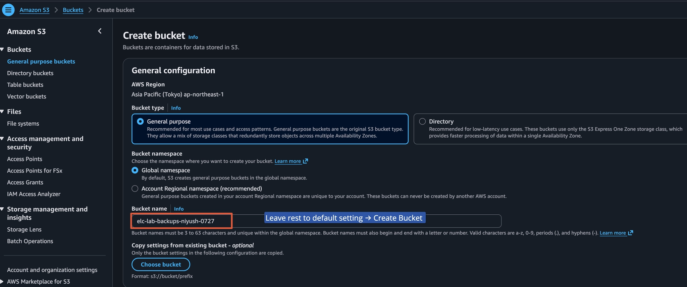


---

### **Step 2: Create the AUTH Token in Secrets Manager (OPTIONAL)**

1. Console → **Secrets Manager → Store a new secret**.
2. **Secret type:** **`Other type of secret`**.
3. **Key/value pairs:** Plaintext tab, paste a 16+ char random string. Generate one:

```bash
# On macOS terminal
openssl rand -base64 24
# Example output: sl3kTsZ8IoJI0lk6W8aPB37rCrzDRnXl
```

1. **Encryption key:** **`DefaultEncryptionKey`** (AWS-managed, free).
2. **Secret name:** **`elc/redis/auth-token`**.
3. Click **Next** → leave rotation disabled → **Next** → **Store**.


💡 **WHY Secrets Manager, not SSM Parameter Store?**

- Secrets Manager supports automatic rotation (Parameter Store does not).
- Secrets Manager encrypts by default; Parameter Store Standard tier does not (only Advanced).
- Secrets Manager integrates natively with RDS/Redshift/DocumentDB.
- **Cost trade-off:** Secrets Manager is $0.40/secret/month; Parameter Store Standard is free. For a 2-hour lab, use Secrets Manager to learn the production pattern. For static non-secret config, use Parameter Store.

⚠️ **Common SAA-C03 trap:** Parameter Store **`SecureString`** uses KMS encryption but is NOT the same as a managed secret with rotation. Choose Secrets Manager when rotation is required.


- Open/Close Screenshot

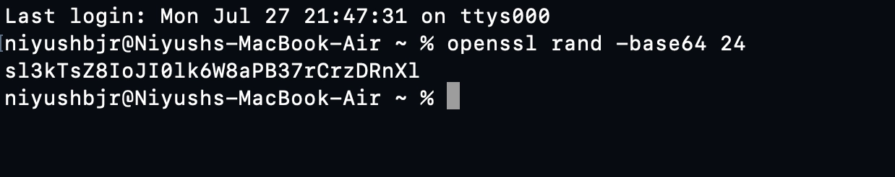

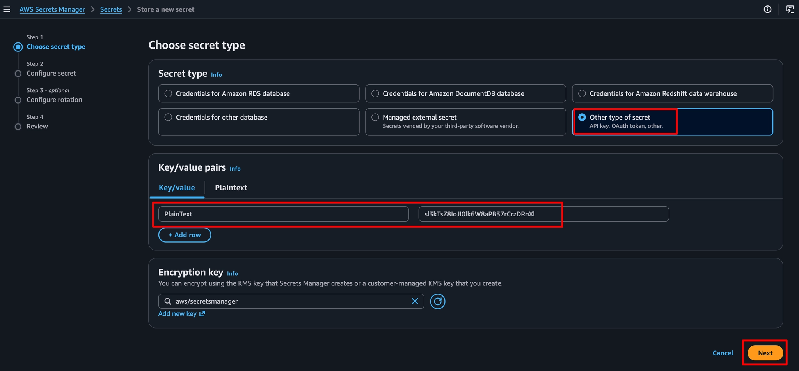

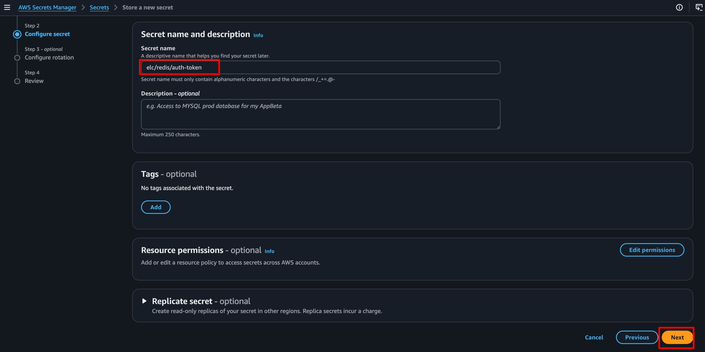

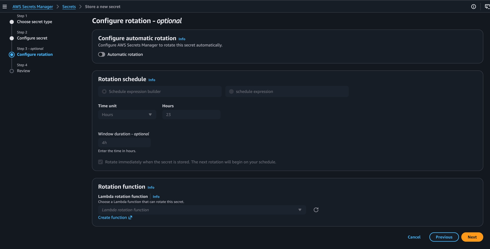

---

### Step 3: Create the Redis Cluster (Cluster Mode DISABLED)


1. ElastiCache console → **Redis clusters → Create Redis cluster**.
2. **Choose cluster settings:** **`Design your own cluster`** (NOT easy create).
3. **Cluster mode:** **`Disabled`** (this gives us 1 primary + optional read replicas, no sharding).
4. **Cluster info:**
    - **Name:** **`elc-lab-redis`**
    - **Description:** **`Lab 2 Redis with AUTH+TLS`**
5. **Cluster settings:**
    - **Engine version:** pick the latest 7.x shown (e.g., **`7.1`**).
    - **Node type:** **`cache.t3.micro`** (only single-node — micro doesn't support replicas).
    - **Number of replicas:** **`0`** (t3.micro supports 0 replicas; we'd need small+ for replicas).
6. **Subnet group settings:**
    - **Subnet group:** **`elc-lab-subnet-group`** (reusing from Lab 1).
7. **Advanced settings → Security:**
    - **Security groups:** select **`elc-lab-memcached-sg`** (reusing — rename via SG if you want, but functionally the SG rules are identical). Actually, create a new SG:
    
    **Create a new SG for Redis (port 6379):**
    
    - VPC console → **Security Groups → Create security group**.
    - Name: **`elc-lab-redis-sg`**
    - VPC: **`elc-lab-vpc`**
    - Inbound: **`Custom TCP`**, port **`6379`**, source = **`elc-lab-ec2-sg`**
    - Create.
    
    Back in ElastiCache wizard:
    
    - Select **`elc-lab-redis-sg`**, remove **`default`**.
8. **Advanced settings → Security → Encryption:**
    - ✅ **Encryption in-transit** → toggle ON.
    - ✅ **Encryption at rest** → toggle ON.
    - **Redis AUTH:** toggle ON → click **Manage Redis AUTH token**.
    - In the dialog, select **Retrieve token from Secrets Manager** → choose secret **`elc/redis/auth-token`**.
    - ⚠️ If the Console doesn't show the Secrets Manager option (region/account dependent), select **Enter token manually** and paste the value of your secret. ⚠️ Note: this stores the token in CloudFormation-like template, which is fine for lab but Secrets Manager integration is the production pattern.
9. **Backup:**
    - ✅ **Automatic backups** → enable.
    - **Backup retention period:** **`1`** day (minimum, to reduce storage cost).
    - **Backup window:** **`No preference`**.
    - **S3 bucket for export:** select **`elc-lab-backups-<your-bucket>`**.
10. **Maintenance window:** **`No preference`**.
11. Click **Create**.

>The cluster will go through **`Creating`** → **`Modifying`** → **`Available`** (5–10 minutes for first-time encryption provisioning).

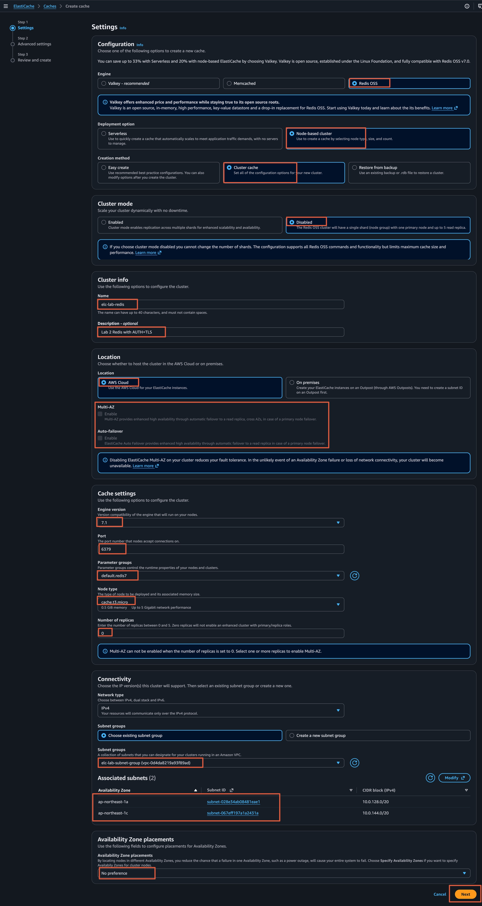

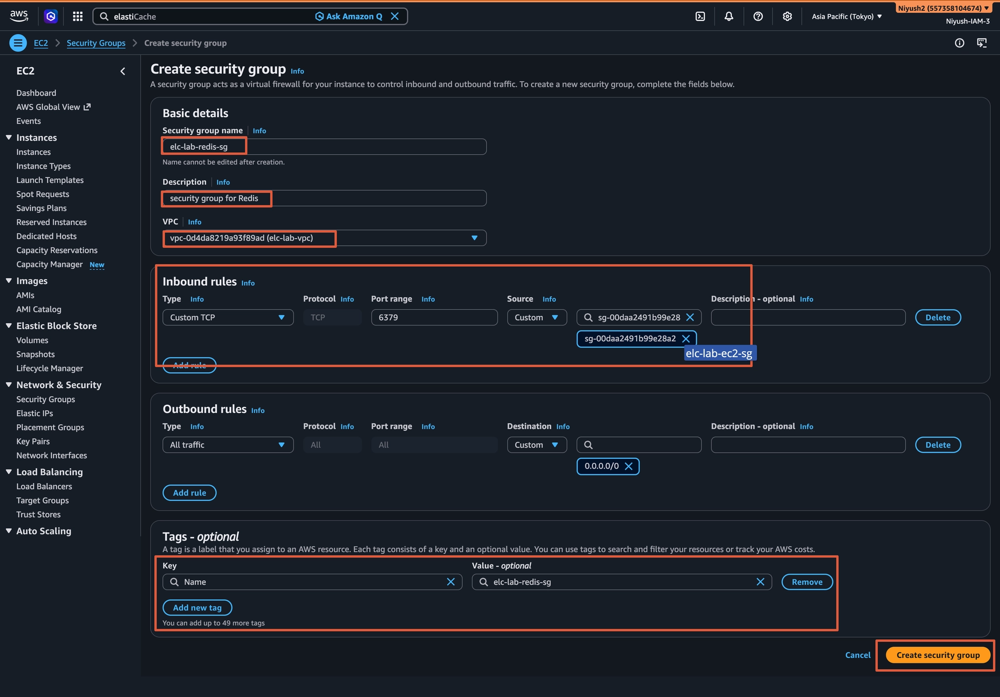

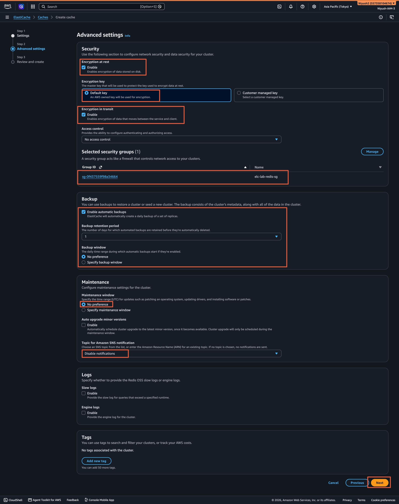

---

### Step 4: Verify Security Configuration

Once the cluster is **`Available`**:

1. Click **`elc-lab-redis`** in the cluster list.
2. Verify the **Security** section shows:
    - ✅ Encryption in-transit: Enabled
    - ✅ Encryption at rest: Enabled
    - ✅ Redis AUTH: Enabled
3. Note the **Primary endpoint** — looks like **`master.elc-lab-redis.xxxxxx.use1.cache.amazonaws.com:6379`**.


>⚠️ **Port is still 6379**, even with TLS. ElastiCache does NOT change the port when TLS is enabled. This is a common confusion point. Some Redis clients auto-detect TLS; some need explicit **`--tls`**. The ElastiCache endpoint behaves as **`rediss://`** (with two s's, indicating TLS).

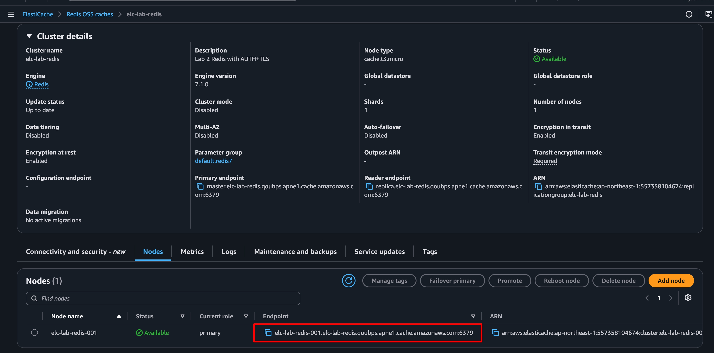

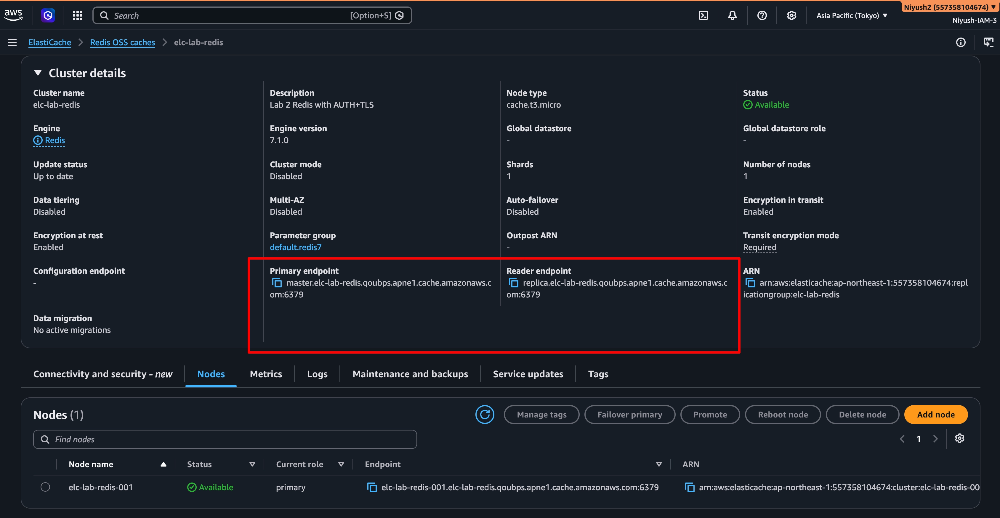

---

### **Step 5: Connect from EC2 Using `redis-cli` with TLS**

First, install **`redis-tools`** (or compile **`redis-cli`** with TLS support). Amazon Linux 2023's **`redis6`** package includes **`redis-cli`** compiled with TLS.

```bash
# Install redis-cli with TLS support
sudo dnf install -y redis6

# Symlink for convenience
sudo ln -sf /usr/bin/redis6-cli /usr/bin/redis-cli
hash -r
which redis-cli
redis-cli --version
# use the ABOVE Command if you prefer to use redis-cli over redis6-cli

# Retrieve the AUTH token from Secrets Manager
TOKEN=$(aws secretsmanager get-secret-value \
  --secret-id elc/redis/auth-token \
  --query SecretString --output text)

# Test connectivity — expect PONG
redis6-cli --tls \
  -h master.elc-lab-redis.xxxxxx.use1.cache.amazonaws.com \
  -p 6379 --no-auth-warning PING
# Expected: PONG
```


>⚠️ If you get **`Could not connect to Redis at ...:6379: Connection refused`**:
    >- Confirm SG rules (Redis SG inbound allows 6379 from EC2 SG).
    >- Confirm EC2 SG outbound allows all (default).
>⚠️ If you get **`NOAUTH Authentication required`**:
    >- You didn't pass **`a "$TOKEN"`** or the token is wrong.
>⚠️ If you get **`WRONGPASS`**:
>- Verify with **`echo $TOKEN`** that it's non-empty and matches the secret.

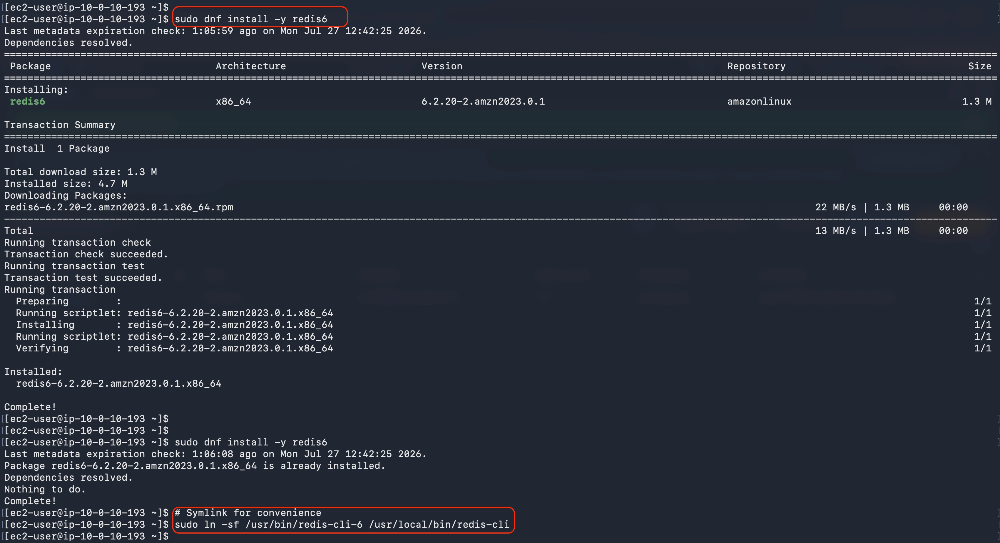

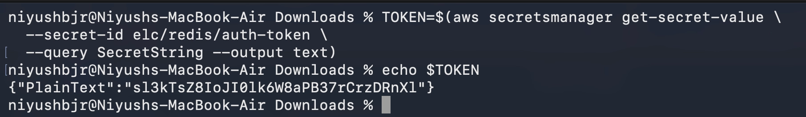

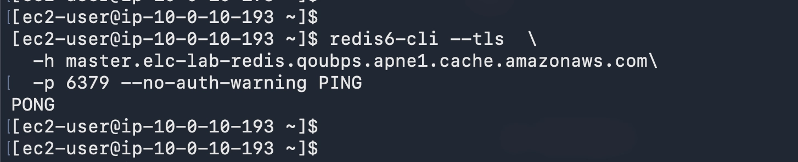

---

### **Step 6: Run Basic Operations**

```bash
# 1. Set host variable
HOST="master.elc-lab-redis.qoubps.apne1.cache.amazonaws.com"

# 2. Set a key with TTL
redis6-cli --tls -h $HOST SET user:1001 '{"name":"Alice","plan":"pro"}' EX 3600

# 3. Get the key
redis6-cli --tls -h $HOST GET user:1001

# 4. Check TTL
redis6-cli --tls -h $HOST TTL user:1001

# 5. List operations
redis6-cli --tls -h $HOST RPUSH queue:tasks "task1" "task2" "task3"
redis6-cli --tls -h $HOST LRANGE queue:tasks 0 -1

# 6. Sorted set (leaderboard pattern)
redis6-cli --tls -h $HOST ZADD leaderboard 1500 "alice" 2300 "bob" 1850 "carol"
redis6-cli --tls -h $HOST ZREVRANGE leaderboard 0 9 WITHSCORES

# 7. Hash (object storage pattern)
redis6-cli --tls -h $HOST HSET product:42 name "Widget" price "9.99" stock "100"
redis6-cli --tls -h $HOST HGETALL product:42

# 8. Server info
redis6-cli --tls -h $HOST INFO memory | grep used_memory_human
```

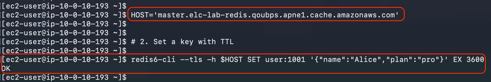

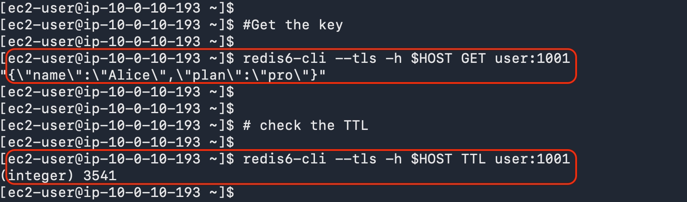

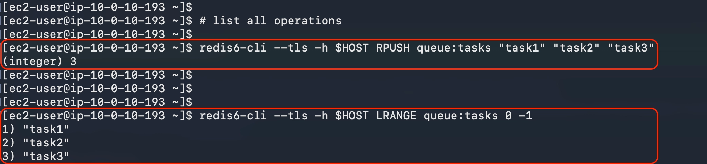

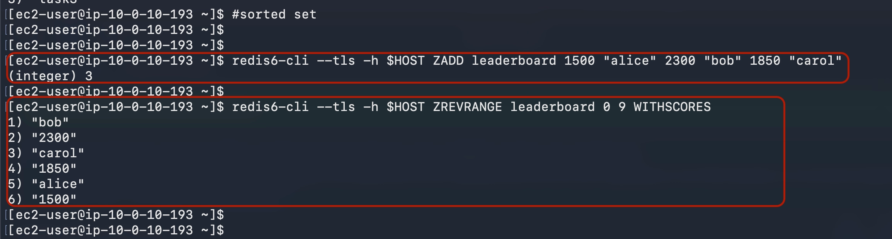

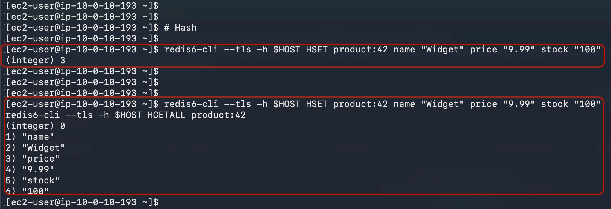

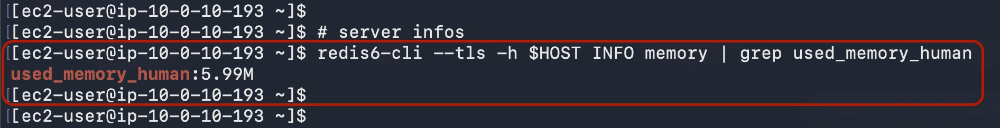

---

### **Step 7: Trigger and Verify an RDB Backup**

>On AWS ElastiCache for Redis, **the `BGSAVE` and `SAVE` commands are explicitly disabled** by AWS for security and stability reasons.
>Because ElastiCache is a managed service, AWS manages memory snapshots and backups for you behind the scenes so that automated persistence operations won't accidentally cause high latency or out-of-memory errors on your node.

```bash
# Force a BGSAVE (background snapshot)
redis6-cli --tls -h $HOST BGSAVE

# Check last save time
redis6-cli --tls -h $HOST LASTSAVE

# Returns Unix timestamp of last successful save
```

---

Console verification:

1. ElastiCache console → **Backups** tab (left nav).
2. You should see an automatic backup named **`automatic.elc-lab-redis-...`**.
3. Click it → **Details** shows the size and timestamp.

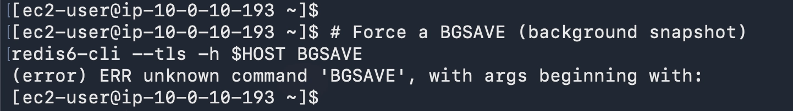

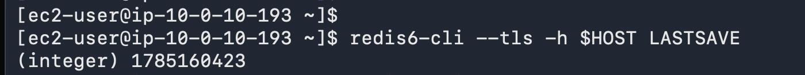

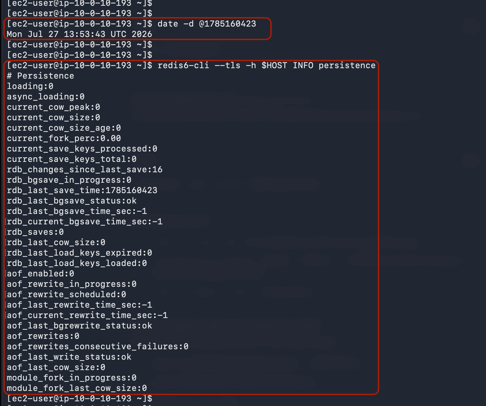

### **Step 8: Simulate a Restart (Redis Persistence Test)**


1. ElastiCache console → **Redis clusters** → **`elc-lab-redis`** → **Modify**.
2. We won't actually modify — but to test persistence, click **Reboot** on the cluster's node.
3. Select the node → **Reboot**.
4. Wait ~30 seconds for **`Available`**.
5. Re-run:

```bash
redis-cli --tls -a "$TOKEN" -h master.elc-lab-redis.xxxxxx.use1.cache.amazonaws.com --no-auth-warning \
  GET user:1001
# Should still return Alice's JSON because RDB was loaded from disk
```

✅ This proves Redis (unlike Memcached) survives a restart if persistence is enabled.

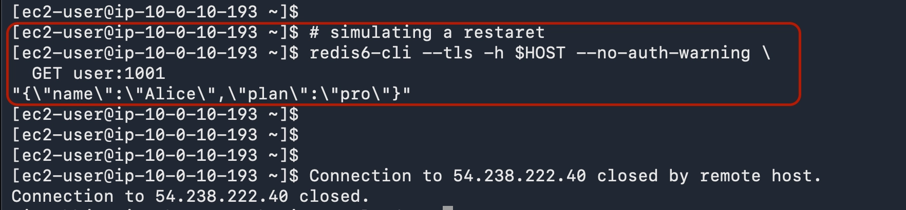

---

### **🗑️ Cleanup — Lab 2**
1. ElastiCache → **Redis clusters** → **`elc-lab-redis`** → **Delete**.
    - **Create final backup?** **`No`** (saves storage cost).
2. Confirm by typing **`delete me`** → **Delete**.
3. **Secrets Manager** → **`elc/redis/auth-token`** → **Delete** (immediate, no waiting period for lab).
4. **S3 bucket:** keep **`elc-lab-backups-...`** (empty, costs $0) OR empty and delete.
5. **Keep EC2, VPC, SGs, subnet group** for Lab 3.


### **Common Mistakes & How to Avoid Them**

| **Mistake** | **Symptom** | **Fix** |
| --- | --- | --- |
| Forgot **`--tls`** flag | **`NOAUTH`** or connection error | ElastiCache requires TLS when enabled |
| Used port 6380 instead of 6379 | Connection refused | ElastiCache uses 6379 even with TLS |
| AUTH token < 16 chars | Cluster creation fails | Use 16+ printable ASCII chars |
| Stored token in plaintext EC2 user-data | Token visible in Console | Use Secrets Manager + IAM role |
| EC2 IAM role missing **`secretsmanager:GetSecretValue`** | **`aws secretsmanager`** returns AccessDenied | Attach inline policy |

**Attach an IAM role to EC2 for Secrets Manager access (do this now if not done):**

1. Console → **EC2 → Instances** → **`elc-lab-client`** → **Actions → Security → Modify IAM role**.
2. Click **Create new IAM role** → opens IAM console in new tab.
3. **Trusted entity:** EC2.
4. **Permissions:** search **`SecretsManagerRead`** → AWS-managed policy **`SecretsManagerReadWrite`** (overkill for lab; for prod use custom inline). Select it.
5. **Role name:** **`elc-lab-ec2-role`**. Create.
6. Back in EC2 tab → refresh role list → select **`elc-lab-ec2-role`** → **Update IAM role**.
7. SSH into EC2, run **`aws secretsmanager get-secret-value --secret-id elc/redis/auth-token --query SecretString --output text`** — should now work without credentials.

---

### **🎯 Key Concepts for SAA-C03**

- 🎯 Redis supports AUTH, TLS, encryption at rest, RDB, AOF. Memcached supports NONE of these.
- 🎯 Cluster mode OFF = 1 primary + up to 5 read replicas. No sharding.
- 🎯 Cluster mode ON = sharding across up to 500 shards, each with 1 primary + 0–5 replicas.
- 🎯 Read replicas can be in different AZs (Multi-AZ). Failover promotes a replica automatically.
- 🎯 Redis AUTH token must be 16+ chars, ASCII printable.
- 🎯 Backups (RDB snapshots) are Redis-only. Memcached has no backup.
- 🎯 Secrets Manager ($0.40/secret/month) vs SSM Parameter Store Standard (free) — choose based on rotation requirement.
- 🎯 To export Redis backups across regions/accounts, you MUST use a customer-owned S3 bucket.

---

### **Practice Questions (Lab 2)**


**Q1.** A security team requires that all data in transit between the application and the cache be encrypted, AND that the cache data be encrypted at rest. They also need to take periodic snapshots for compliance. Which combination meets these requirements with the LEAST operational overhead?

- A. Memcached with TLS enabled, no snapshots
- B. Redis with TLS + at-rest encryption + automatic backups
- C. Redis on EC2 with EBS encryption + stunnel
- D. DynamoDB with KMS encryption + DAX
- Answer
    
    **Answer: B.** 🎯 Only Redis supports all three (TLS, at-rest encryption, snapshots). Memcached lacks at-rest encryption and snapshots. EC2-managed Redis (C) is higher operational overhead. DAX (D) doesn't support custom snapshot schedules the same way.
    
---

**Q2.** You are configuring an ElastiCache for Redis cluster with AUTH. Which of the following is true about the AUTH token?

- A. It must be exactly 16 characters
- B. It can be rotated without downtime using Secrets Manager rotation Lambda
- C. It can be retrieved from any IAM role with **`secretsmanager:GetSecretValue`** if you store it there
- D. The token is transmitted in plaintext even with TLS enabled
- Answer
    
    **Answer: C.** 🎯 AUTH tokens must be 16–132 chars (not exactly 16). Rotation requires modifying the cluster (some downtime). With TLS enabled, the token is encrypted in transit. IAM controls access to the secret.
    
---

**Q3.** Your team wants to migrate an ElastiCache Redis cluster from us-east-1 to eu-west-1 with minimal downtime. Which approach requires the LEAST code change?

- A. Snapshot the source cluster, copy snapshot to S3 in eu-west-1, create new cluster from snapshot
- B. Use Global Datastore to add eu-west-1 as a secondary, then promote it
- C. Run **`redis-cli --rdb`** from an EC2 in eu-west-1
- D. Use AWS DMS to replicate Redis
- Answer
    
    **Answer: B.** 🎯 Global Datastore is the AWS-native solution for cross-region Redis replication with promotion. (A) requires manual snapshot copy and has downtime during the switch. (C) is a one-time dump, not live replication. (D) DMS doesn't support Redis as a source.
    

---

### **📊 Summary**
| **Done** | **Why it matters** |
| --- | --- |
| Provisioned Redis with AUTH + TLS + at-rest encryption | Production-grade cache security posture |
| Stored AUTH token in Secrets Manager | Canonical pattern for secret rotation |
| Used IAM role (not access keys) on EC2 | Best practice for credentials |
| Verified TLS connectivity with **`redis-cli --tls`** | Memcached tooling doesn't work; must use TLS-aware client |
| Triggered RDB BGSAVE manually | Proves persistence mechanism |
| Tested restart persistence | Validates Redis survives node restarts (Memcached does not) |

