# Lab 3: Redis Cluster Mode Enabled (Sharding + Replicas)

---

<aside>


### **What You'll Learn**

- The architectural difference between Cluster Mode DISABLED vs ENABLED
- How data sharding works in Redis (16384 hash slots)
- Deploying a Multi-AZ sharded cluster with Read Replicas
- Connecting via **`redis-cli -c`** (cluster mode) and observing keys redirect to different shards

</aside>

---

### **Architecture**

```markdown
   VPC: 10.0.0.0/16
   ├── Private Subnet A (us-east-1a) 10.0.2.0/24
   │       └── Shard 1: Primary Node  ──► Replica Node (in 1b)
   │       └── Shard 2: Primary Node  ──► Replica Node (in 1b)
   │
   └── Private Subnet B (us-east-1b) 10.0.3.0/24  (NEW for this lab)
           └── Shard 1: Replica Node ──► (Primary in 1a)
           └── Shard 2: Replica Node ──► (Primary in 1a)

   EC2 Client (Public Subnet A)
```

---

### **💴 Cost for This Lab (2-hour session)**

| **Resource** | **Type** | **Qty** | **Hours** | **Cost** |
| --- | --- | --- | --- | --- |
| ElastiCache Redis | **`cache.t3.small`** | 4 | 2 | $0.27 |
| **Total** |  |  |  | **~$0.27** |


>⚠️ **Cost Warning:** **`cache.t3.micro`** does NOT support replicas. To do cluster mode with replicas, **`t3.small`** is the minimum. 4 nodes x $0.034/hr = $0.136/hr. **Delete this cluster immediately after the lab to avoid $98/month in charges.**

---

### **Step 1: Add a Second Private Subnet (Required for Multi-AZ)**

1. Go to **VPC → Subnets → Create subnet**.
2. **VPC ID:** **`elc-lab-vpc`**.
3. **Subnet name:** **`elc-lab-private-subnet-private-us-east-1b`**.
4. **Availability Zone:** **`us-east-1b`**.
5. **IPv4 CIDR block:** **`10.0.3.0/24`**.
6. Click **Create subnet**.
7. **Enable Auto-assign IP:** Select the new subnet → **Actions → Edit subnet settings** → check "Enable auto-assign private IP DNS" (optional but good practice) → **Save**. (Note: ElastiCache handles IP assignment, this is just hygiene).

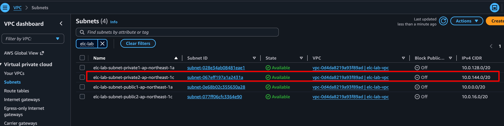

---

### **Step 2: Update ElastiCache Subnet Group**

1. Go to **ElastiCache → Subnet groups → `elc-lab-subnet-group`**.
2. Click **Modify**.
3. Under **Subnets**, select BOTH **`10.0.2.0/24`** (1a) and **`10.0.3.0/24`** (1b).
4. Click **Modify** → **Modify** again to confirm.


>💡 **WHY?** Cluster Mode Enabled with replicas requires Multi-AZ for high availability. ElastiCache needs to know it can place nodes in both AZs.


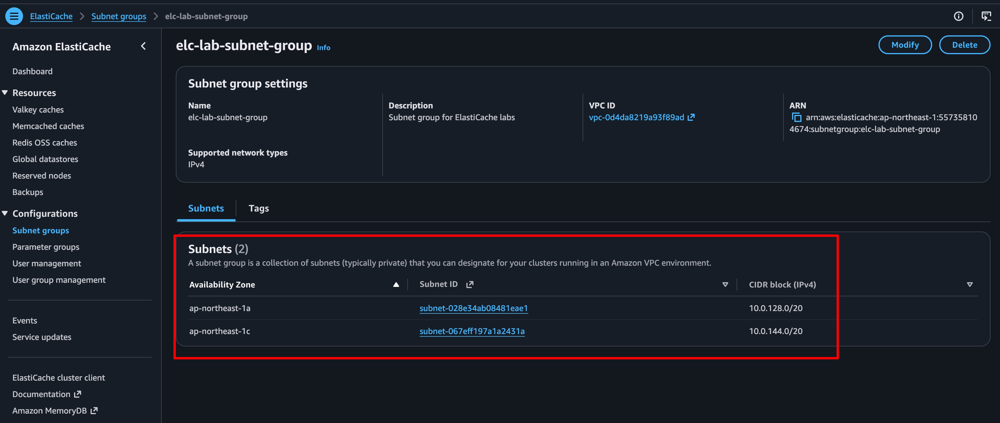


---

### **Step 3: Create the Cluster Mode Enabled Cluster**

1. Go to **ElastiCache → Redis clusters → Create Redis cluster**.
2. **Choose cluster settings:** **`Design your own cluster`**.
3. **Cluster mode:** ✅ **Enabled** (Crucial step).
4. **Cluster info:**
    - **Name:** **`elc-lab-redis-cluster`**
5. **Cluster settings:**
    - **Engine version:** **`7.1`** (or latest 7.x).
    - **Node type:** Click **Choose node type** → **`Current generation`** → **`cache.t3.small`** → **Save**.
    - **Number of shards:** **`2`** (This creates 2 primary nodes, splitting data in half).
    - **Replicas per shard:** **`1`** (This creates 1 read replica per primary. Total nodes = 2 primaries + 2 replicas = 4).
    - **Multi-AZ:** Automatically enabled when replicas > 0.
6. **Subnet group settings:**
    - **Subnet group:** **`elc-lab-subnet-group`**.
7. **Advanced settings → Security:**
    - **Security groups:** Select **`elc-lab-redis-sg`** (from Lab 2). Remove **`default`**.
8. **Advanced settings → Security → Encryption:**
    - ✅ **Encryption in-transit:** ON (Required for AUTH).
    - ✅ **Encryption at rest:** ON.
    - ✅ **Redis AUTH:** ON → **Enter token manually** → paste the same token from Lab 2 (or generate a new 16+ char string).
9. **Backups:** Disable (to save storage cost for this short lab).
10. Click **Create**.

>Provisioning will take ~8–10 minutes. You will see 4 nodes under the cluster tab: 2 master (primary) and 2 replica.

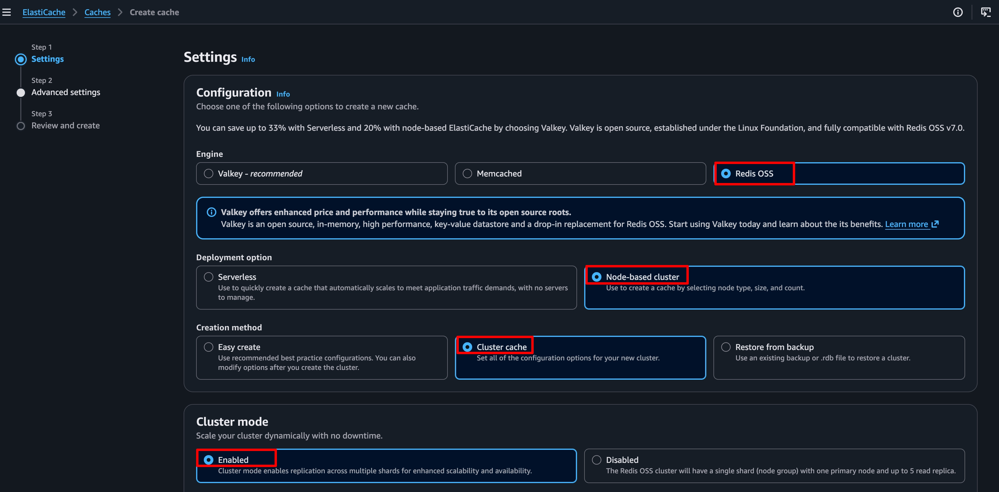

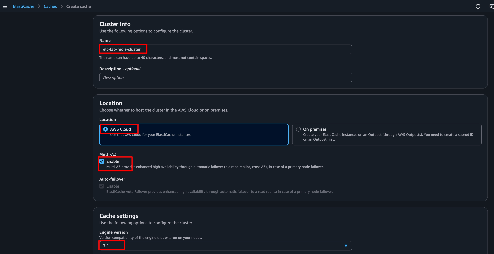

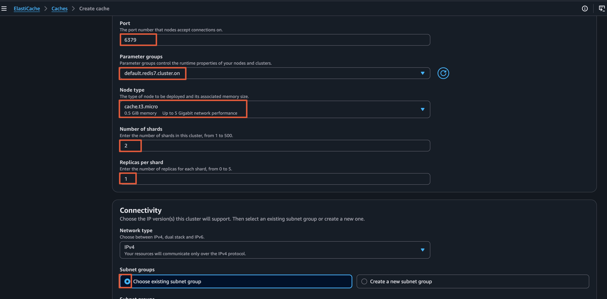

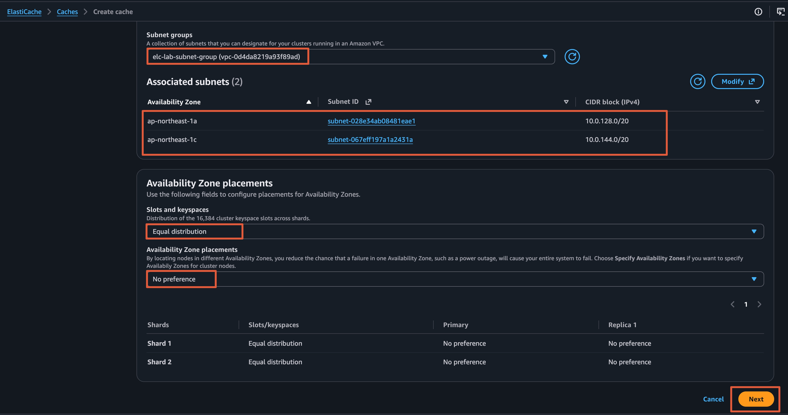

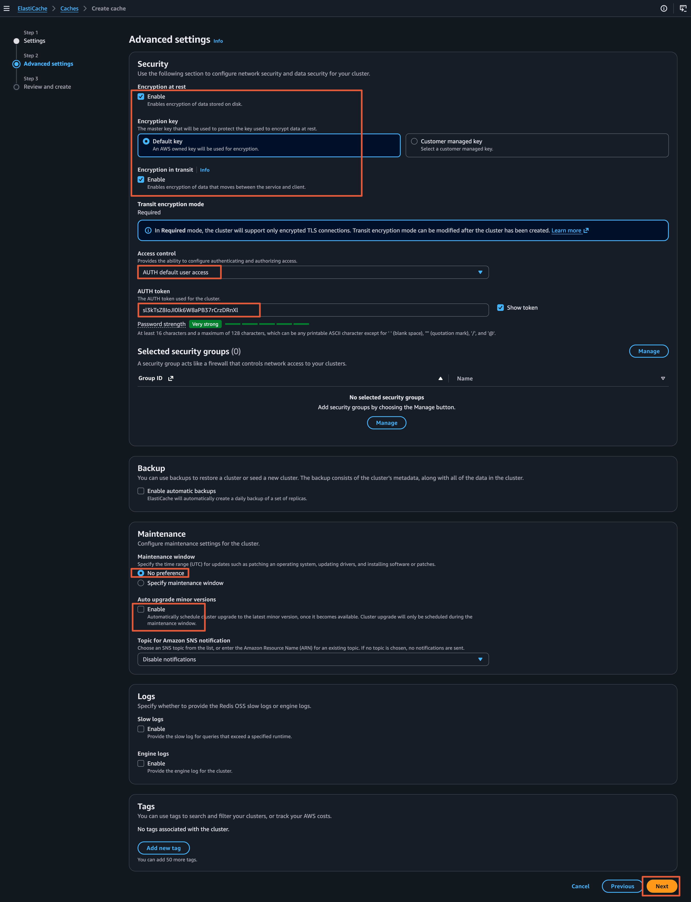

---

### **Step 4: Understand the Configuration Endpoint**

1. Click on **`elc-lab-redis-cluster`**.
2. Look at the **Configuration endpoint**. It looks like: **`clustercfg.elc-lab-redis-cluster.xxxxxx.use1.cache.amazonaws.com:6379`**.


>**WHY Configuration Endpoint?**
> - In Cluster Mode DISABLED, you connect to the Primary Endpoint.
> - In Cluster Mode ENABLED, you connect to the **Configuration Endpoint.**
>The client uses this to discover all shard endpoints and their hash slot ranges. A "smart client" (like `redis-cli -c`) automatically routes commands to the correct shard based on the CRC16 hash of the key.
>.

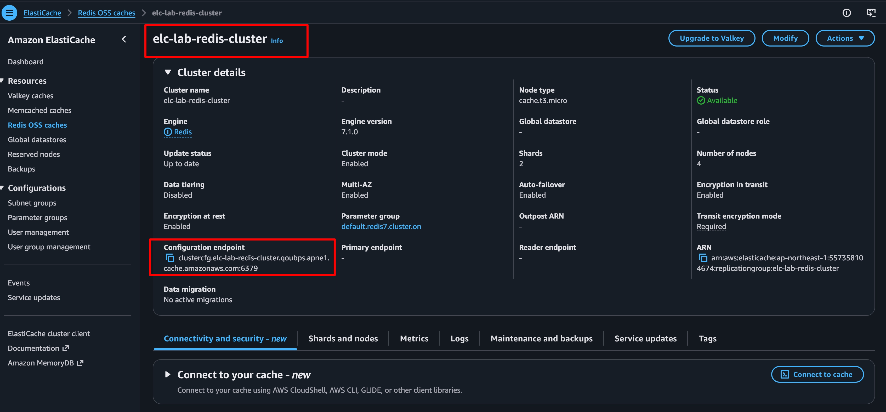

---

### **Step 5: Connect and Test Sharding**

- Command if the AuthACL for Elasticache is enabled.
    
    ```bash
    # SSH into your EC2 instance:
    # Retrieve token (if you reused the secret, otherwise use your hardcoded string)
    TOKEN=$(aws secretsmanager get-secret-value --secret-id elc/redis/auth-token --query SecretString --output text)
    
    # Connect using cluster mode flag (-c). 
    # Note: Use the Configuration Endpoint here.
    ENDPOINT="clustercfg.elc-lab-redis-cluster.xxxxxx.use1.cache.amazonaws.com"
    
    # Test connection
    redis-cli --tls -a "$TOKEN" -h $ENDPOINT -p 6379 --no-auth-warning -c PING
    # Expect: PONG
    
    # Set keys and watch the redirection happen.
    # Redis Cluster uses CRC16 to map keys to 1 of 16384 slots, distributed across shards.
    redis-cli --tls -a "$TOKEN" -h $ENDPOINT -p 6379 --no-auth-warning -c SET user:1001 "Alice"
    # Look at the output! It will say:
    # -> Redirected to slot [9842] located at 10.0.2.x:6379
    # OK
    
    redis-cli --tls -a "$TOKEN" -h $ENDPOINT -p 6379 --no-auth-warning -c SET user:1002 "Bob"
    # -> Redirected to slot [11478] located at 10.0.3.y:6379
    # OK
    
    # Check the cluster topology
    redis-cli --tls -a "$TOKEN" -h $ENDPOINT -p 6379 --no-auth-warning -c CLUSTER NODES
    # You will see 4 nodes: 2 masters and 2 slaves (replicas).
    # Notice the "slots" assigned to each master (e.g., 0-8191 and 8192-16383).
    
    ```

- Command for redis-cli if Auth ACL isn’t used/TOKEN
    
    ```bash
    ENDPOINT="clustercfg.elc-lab-redis-cluster.xxxxxx.use1.cache.amazonaws.com"
    
    # 1. Test connection
    redis-cli --tls -h $ENDPOINT -p 6379 -c PING
    # Expect: PONG
    
    # 2. Set key 1 (watch cluster slot redirection)
    redis-cli --tls -h $ENDPOINT -p 6379 -c SET user:1001 "Alice"
    # Expect: -> Redirected to slot [9842] located at <node-ip>:6379
    # OK
    
    # 3. Set key 2 (routes to a different slot/shard)
    redis-cli --tls -h $ENDPOINT -p 6379 -c SET user:1002 "Bob"
    # Expect: -> Redirected to slot [11478] located at <node-ip>:6379
    # OK
    
    # 4. Check cluster topology
    redis-cli --tls -h $ENDPOINT -p 6379 -c CLUSTER NODES
    ```

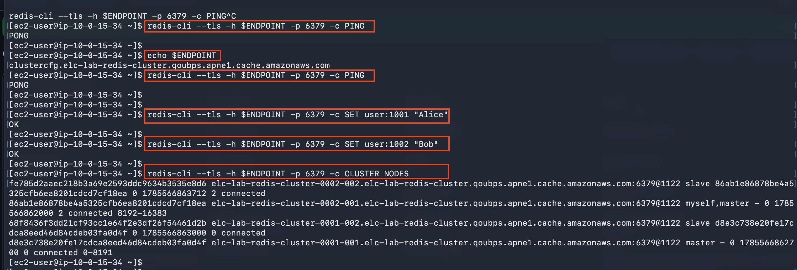

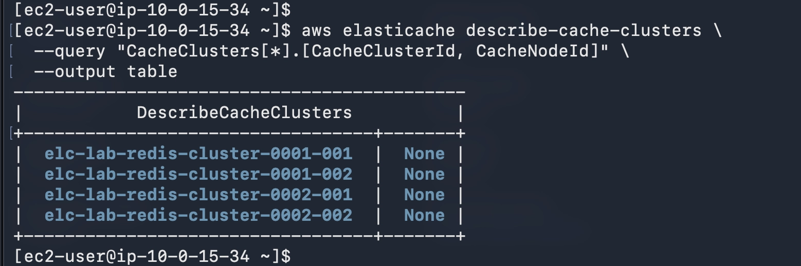

---

### **Step 6: Test Failover (Multi-AZ in action)**

1. Go to the ElastiCache Console → **`elc-lab-redis-cluster`**.
2. Under the **Nodes** tab, find one of the **`master`** nodes (e.g., the one in **`us-east-1a`**).
3. Select it → Click **Reboot**.
4. In the dialog, check "Sync changes before reboot" (not strictly necessary for lab) → **Reboot**.
5. Immediately go to your SSH session and run:

```bash
# Spam this command to see the brief failure and recovery
watch -n 1 "redis-cli --tls -a \"$TOKEN\" -h $ENDPOINT -p 6379 --no-auth-warning -c GET user:1001"

```
<br>

✅ Verification:
You will see the command fail for a few seconds (`READONLY` or connection error), then ElastiCache will automatically promote the replica in `us-east-1b` to primary. The command will succeed again without you changing the endpoint. This is the power of Multi-AZ failover.

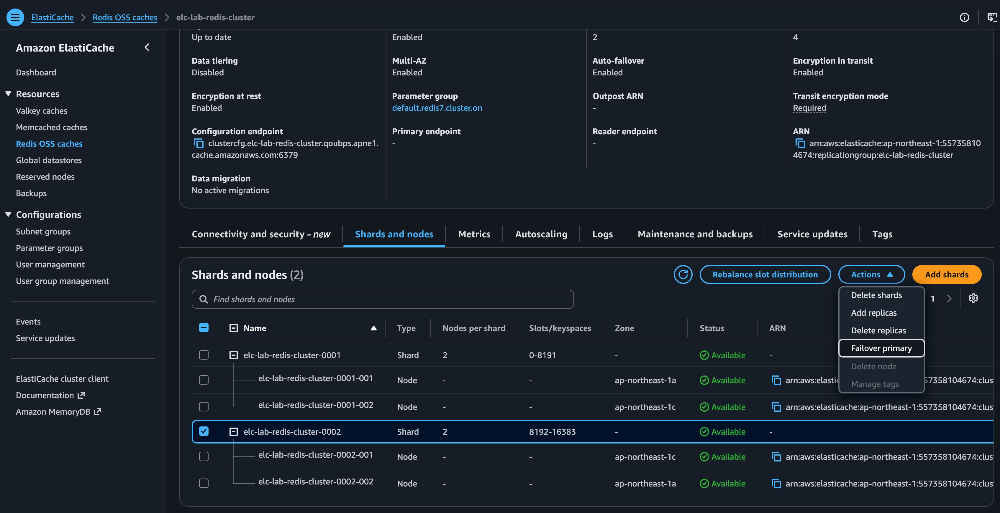

---

### **🗑️ Cleanup — Lab 3**

1. ElastiCache → **Redis clusters** → **`elc-lab-redis-cluster`** → **Delete**.
2. **Create final backup?** **`No`**.
3. Confirm by typing **`delete me`**.
4. Wait for status to become **`Deleted`**.
5. Keep the VPC, SGs, and EC2 instance for Lab 4.

---

### **🎯 Key Concepts for SAA-C03**

- 🎯 Cluster Mode ENABLED partitions data across shards (1 to 500 shards). Cluster Mode DISABLED keeps all data on one primary.
- 🎯 To scale *write* performance, you MUST use Cluster Mode Enabled (sharding). Adding replicas in Cluster Mode Disabled does NOT increase write capacity.
- 🎯 The Configuration Endpoint is used for Cluster Mode Enabled. The Primary Endpoint is used for Cluster Mode Disabled.
- 🎯 Redis Cluster has 16,384 hash slots. **`CRC16(key) % 16384`** determines the slot.
- 🎯 Multi-AZ is automatic in Cluster Mode Enabled if **`replicas > 0`**.

---

### **Practice Questions (Lab 3)**


**Q1.** A gaming company is using ElastiCache for Redis (Cluster Mode Disabled) with 1 primary and 5 read replicas. They are experiencing high CPU utilization and write latency on the primary node during peak hours. What is the MOST cost-effective way to scale write capacity?

- A. Increase the node size of the primary and all replicas (Scale up)
- B. Convert to Cluster Mode Enabled with multiple shards (Scale out)
- C. Add more read replicas to offload writes
- D. Enable Multi-AZ
- Answer
    
    **Answer: B.** 🎯 In Cluster Mode Disabled, ALL writes go to the single primary node. Adding replicas (C) only scales read capacity. To scale writes, you must shard the data using Cluster Mode Enabled. (A) works but is less cost-effective/flexible than horizontal scaling for long-term growth.
    

---

**Q2.** An application needs to connect to an ElastiCache Redis cluster configured with Cluster Mode Enabled. Which endpoint should the application use in its connection string to ensure traffic is routed correctly as the cluster scales?

- A. The Primary Endpoint
- B. The Reader Endpoint
- C. The Configuration Endpoint
- D. The Node Endpoint of shard 1
- Answer
    
    **Answer: C.** 🎯 The Configuration Endpoint is a DNS record that ElastiCache keeps updated as nodes are added/removed. Smart clients use it to discover the cluster topology and route commands to the correct shard based on hash slots.
    

---

### **📊 Summary**

| **Done** | **Why it matters** |
| --- | --- |
| Added 2nd private subnet | Multi-AZ requires multiple AZs in the subnet group |
| Deployed 2-shard cluster with replicas | Demonstrates HA + Sharding topology |
| Connected via Configuration Endpoint | Proves smart client routing works |
| Observed hash slot redirection | Visualizes how data is partitioned in Redis |
| Triggered Multi-AZ failover | Proves automatic replica promotion works |